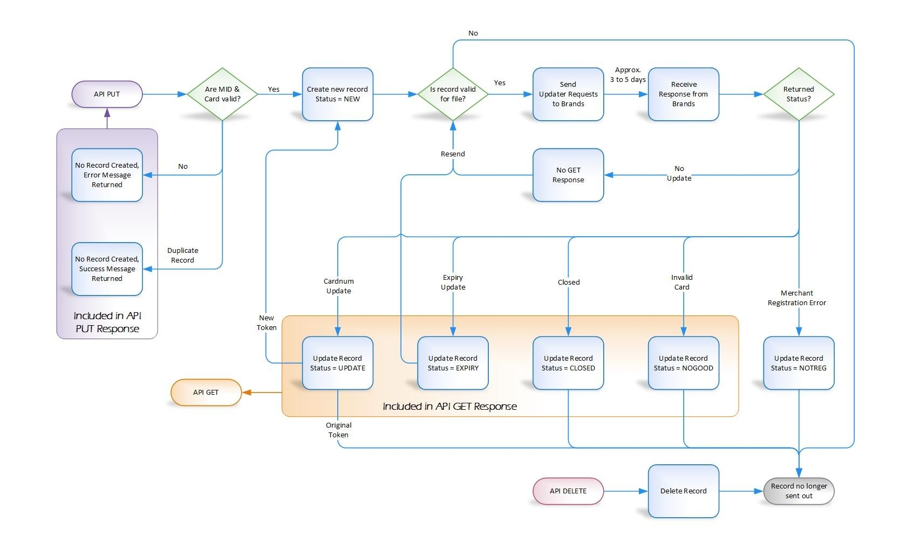

# Overview

The Card Account Updater service provides merchants the ability to keep their customers' card data up-to-date.

## What's New?

### Date Updated 11/13/2021

**GET Request Support for Profiles**

The GET request now includes an optional query parameter, `profiles=true`, to include corresponding CardPointe Gateway profile details (`profileid`/`acctid` pair) for updates linked to profiles in the GET response.

### Date Updated: 7/20/2021 

- **CONTAC Status Added to GET Response**

    The `status` field in the GET response now supports the `CONTAC` status, which indicates that you should contact the issuer for more information on the status of the card account.

- **Card Account Updater Reporting**

    Card Account Updater reporting is now available in the CardPointe web application. The Card Updates page, available from the Reporting tab, includes an Update History report that displays all Card Account Updater events that occurred within the past year, as well as a Decline Report that displays all declined transactions and the most recent update for each card.

    See the Card Account Updater Reporting topic in the CardPointe Web App User's Guide for detailed information.

## Requirements

To take advantage of the Card Account Updater service, you must meet the following requirements:

- Your merchant account must be enrolled in the Card Account Updater service.

- Your merchant account must be acquired by CardConnect.

- You must use the CardPointe Gateway's Profile service to store customer payment account information, **or** manually enroll specific accounts by making a PUT request to the updater resource of the CardPointe Gateway API.

- If you are using the CardPointe Gateway profile service, profiles must include `"auoptout":"N"` (the default value if not specified). Setting `"auoptout":"y"` opts a profile out of the Card Account Updater service, and the profile will not be checked for updates.

- Whether you are using the CardPointe Gateway's profile service or you are managing your own cardholder profiles using tokens, you must comply with the Visa and Mastercard Stored Credential Transaction Framework Mandate. This card brand mandate includes requirements for obtaining cardholder consent, as well as API and application changes required to appropriately identify transactions using stored customer data. See our support article for detailed information on these requirements.

<!-- theme: warning -->
> Use the inquireMerchant endpoint of the CardPointe Gateway API to determine whether the merchant account is enrolled in the Card Account Updater service.

## Limitations

Consider the following limitations:

- Card Account Updater is only available for merchants on the **First Data North** and **Rapid Connect** back-end processors.
This service only provides updates for **Visa**, **Mastercard**, and **Discover** accounts.
- Additionally, the Card Account Updater API is intended as **alternative solution** to enrolling accounts in the Card Account Updater Service via stored profiles. Using both solutions may cause data integrity issues.

If you currently use the CardPointe Gateway's Profile service to store and manage cardholder profiles, contact isvsupport@fiserv.com before enrolling any accounts using the Card Account Update API.

# Getting Started

To use the Card Account Updater service, you must be enrolled in the service. Contact Support to add the Card Account Updater service to your merchant account.

## How it Works

The Updater service requests daily updates from Visa, Mastercard, and Discover for accounts that are enrolled in this service via CardPointe Gateway profiles, and accounts that have been enrolled using this API. The card brands respond within 3-5 days with any changes to the account, such as:

- new account number
- new expiration date
- account closure

Accounts that are stored in a CardPointe Gateway profile and enrolled in this service are updated automatically when changes to card data are reported by the card brand, while changes to card data for accounts that have been enrolled using the API are stored and can be retrieved at any time using the GET request.

If the card brand reports that a new card has replaced the existing one, or a replacement card was issued with a new expiration date, the new card data is tokenized and takes the place of the previous card data for that account. The new card data is then continually monitored for any further changes.

If the card brand reports that an account has been closed, or a newly enrolled account is invalid, the account is no longer monitored for updates.

If the card brand reports no change in card data for a specific account, the Updater service continues to request updates for that account. Requests for changes in card data are sent daily, but as the card brands typically respond within 3-5 days, an individual account is checked 1-2 times per week for any change.

The following diagram illustrates the Card Account Updater service workflow:

<!-- align: center -->


## Enrolling an Account

Accounts can be enrolled by setting `"auoptout":"N"` for a CardPointe Gateway's profile, or by using a PUT request to the updater endpoint of the CardPointe Gateway API to manually enroll individual accounts.

See the CardPointe Gateway Profile service description for more information on stored profiles.

## Postman Collection

To help you get started with your integration, we have created a Postman Collection that includes all of the requests outlined in this document. 

Included with the collection is a Postman Environment containing variables for your API key and Merchant ID. Enter your API key and Merchant ID in these environment variables before sending any API requests.

[Run in Postman](https://app.getpostman.com/run-collection/d3cbca34902b29fbbb22#?env%5BCard%20Account%20Updater%5D=W3sia2V5Ijoic2l0ZSIsInZhbHVlIjoie1VBVCBvciBwcm9kdWN0aW9uIHNpdGV9IiwiZW5hYmxlZCI6dHJ1ZX0seyJrZXkiOiJ1cmwiLCJ2YWx1ZSI6Imh0dHBzOi8ve3tzaXRlfX0uY2FyZGNvbm5lY3QuY29tL2NhcmRjb25uZWN0L3Jlc3QiLCJlbmFibGVkIjp0cnVlfSx7ImtleSI6IkF1dGhvcml6YXRpb24iLCJ2YWx1ZSI6IntBUEkga2V5fSIsImVuYWJsZWQiOnRydWV9LHsia2V5IjoibWVyY2hpZCIsInZhbHVlIjoie0NhcmRDb25uZWN0IE1JRH0iLCJlbmFibGVkIjp0cnVlfV0=)

<!-- theme: warning -->
> See the [Postman user documentation](https://learning.postman.com/docs/introduction/overview/) for detailed information on using Postman to test APIs.

# Getting Updates using the CardPointe Gateway API

The Card Account Updater API includes support for tokenization of clear text primary account numbers (PANs) in PUT requests, pagination of GET requests, and the ability to submit DELETE requests.

Use the PUT method to manually submit tokens or clear text PANs to the Card Account Updater service.

Use the GET method to retrieve data about recent updates.

Use the DELETE method to manually remove tokens from the Card Account Updater service.

> The DELETE method does not unenroll accounts that are associated with a stored profile. Use the CardPointe Gateway profile endpoint to set `"auoptout":"Y"` for accounts associated with a stored profile.

## Updater Service URL

Your application communicates with the CardPointe Gateway RESTful web service using the following base URL:

`https://<site>.cardconnect.com/cardconnect/rest/v2/updater`

## Authorization

A username and password are required in the HTTP Authorization Header property in each API request. Use the API credentials that were provided for use with your merchant account.

Basic Authorization is expected, using a Base64-encoded username and password string as the value. If this value is incorrect or not provided in the request header, HTTP Status 401 Unauthorized is returned to the caller.

See the API Connectivity Guide for more information on connecting to the CardPointe Gateway and other services.

## Updater Service PUT Request

The PUT request enrolls accounts in the Card Account Updater service manually, by supplying tokens or clear PANs. These accounts are monitored for changes in account status, expiry, or card number. Card Account Updater relies on information provided by Visa, Mastercard, and Discover to determine when a change has occurred, and stores the changes for retrieval using the GET method.

### PUT Request Headers

|  |  | 
| --- | --- |
| Authorization | Basic |
| Content Type | application/json | 

### PUT Request Body

Parameters in **bold** are required.

| Body Parameter | Type | Description | 
| --- | --- | --- |
| **merchid** | String | The CardPointe Merchant ID associated with the stored profiles <br> <br> **Note**: _The merchant account must be acquired by CardConnect and enrolled in the Card Account Updater service._ |
| **accounts** | Array | An array of accounts to enroll. See Accounts Array for details. <br> <br> **Note**: _The maximum number of accounts per PUT request is limited to 2,000_ |

### Accounts Array

The accounts array consists of objects containing the `account` parameter, and optionally, the `expiry` parameter.

| Body Parameter | Type | Description | 
| --- | --- | --- |
| **account** | String | The 16 digit token or PAN to enroll <br> <br> **Note**: _If a clear PAN is provided, the PAN is tokenized and the token is returned in any GET method responses._ |
| expiry | String | The card's expiration date in MMYY format <br> <br> **Note**: _To avoid potential charges as a result of the service obtaining the expiry automatically, it is best practice to include the expiry whenever possible. Omitting the expiry or providing the expiry in an incorrect format will result in the expiry returned by the card brands to be counted as a billable update due to the mismatch._ |

#### Example: PUT Request Body

```json
{
    "merchid": "1234567890",     
    "accounts": [
        {
            "account": "4111111111111111",
            "expiry": "0122" 
        },
        {
            "account": "9434567891111111",
            "expiry": "0525"         
        }
    ]
}
```

## Updater Service PUT Response

A successful PUT request returns a JSON-encoded response with a summary of the results, including the tokenized values of any clear text PANs provided, and any errors encountered.

An unsuccessful PUT request returns HTTP Status 4xx, with a JSON-encoded response that includes the errors array containing additional information.

| Field | Type | Description | 
| --- | --- | --- |
| merchid | String | The CardPointe Merchant ID specified in the request
| total	| Number | The total number of updates
| successes	| Number | The number of accounts successfully enrolled
| failures | Number | The number of accounts not enrolled
| tokens | Array | An array of enrolled accounts. See Tokens Array for details.
| errors | Array | An array of errors encountered. See Errors Array for details.

### Tokens Array

For each clear text PAN provided in the request, an object is returned within the tokens array, containing the `account` provided and its associated `token`.

| Field | Type | Comments | 
| --- | --- | --- |
| account | String | The PAN submitted in the request
| token	| String | The tokenized value of the PAN

### Errors Array

For each failure, an object is returned within the errors array, containing the `field` and associated error `message`.

| Field | Type | Description | 
| --- | --- | --- |
| field | String | The token or PAN that caused the error <br> <br> **Note**: _HTTP Status 4xx responses return the request field that caused the error._ |
| message | String | One of the following error messages: <br> <br> invalid card <br> can not tokenize <br> <br> **Note**: _HTTP Status 4xx responses return additional details about the error encountered._ |

#### Example: PUT Response Body

```json
{
    "merchid" : "1234567890",
    "total" : 12,
    "successes" : 8,
    "failures" : 4,
    "tokens" : [
        {
            "account" : "4111111111111111",
            "token" : "9411673941601111"        
        }
    ],
    "errors" : [
        {
            "field" : "4111111/111111111",        
            "message" : "invalid card"
        },
        {
            "field" : "4111111111111111",
            "message" : "can not tokenize"
        }
    ]
}
```

#### Example: Unsuccessful PUT Response Body

```json
{
    "errors" : [
        "field" : "accounts",
        "message" : "must not be null or missing or empty"
    ]    
}
```

## Updater Service GET Request

The GET request retrieves all available account changes that have occurred within the 30 day period preceding the current date, or within the previous number of days specified using the `daysBack` parameter.

<!-- theme: warning -->
> Additionally, you can view update history details for the past year in the CardPointe Web App, on the **Card Updates** page. See the Card Account Updater Reporting topic in the CardPointe Web App Users' Guide for more information.

### GET Request Headers

|  |  |
| --- | --- |
| **Authorization** | Basic | 

### GET Request Parameters

Parameters in **bold** are required.

| Parameter	| Type | Comments |
| --- | --- | --- |
| merchid | Query | The Merchant ID associated with the stored profiles or accounts <br> <br> **Note**: _The merchant account must be enrolled in the Card Account Updater service._
| daysBack | Query | The number of days prior to the current date, used to retrieve updates reported within that period <br> <br> **Note**: _Defaults to 30 if not provided._
| date | Query | A date in YYYYMMDD format <br> <br> **Note**: _This parameter is now deprecated. The current date is used in conjunction with the daysBack parameter to determine the applicable period for retrieving updates._
| page | Query | The number of the page being requested <br> <br> **Note**: Defaults to 1 if not provided.
| profiles | Query | A true or false value where true returns an array of linked profiles when the account in an update record is linked to a CardPointe Gateway profile. <br> <br> **Note**: _Defaults to false if not provided._
| binInfo | Query | A true or false value where true returns the Bank Identification Number (BIN) information when an update record for the account includes a new card number. <br> <br> **Note**: _Defaults to false if not provided._

#### Example: GET Request

```PHP
curl -u "username:password" \
'https://fts-uat.cardconnect.com/cardconnect/rest/v2/updater?merchid=1234567890 \
&date=20190731 \
&page=2'
```

## Update Service GET Response

The JSON-encoded response includes all updates that occurred within the 30 days preceding the current date, or in the preceding number of days specified using the `daysBack` parameter.

| Field	| Type	| Comments |
| --- | --- | --- |
| pageNumber | Number | The number of the current page of results
| perPageSize | Number | The number of results per page
| currentPageSize | Number | The number of results contained in the current page
| totalPages | Number | The total number of pages
| totalUpdates | Number	| The total number of updates for the period
| updatesStartDate | String	| The start date of the time period used to retrieve updates
| updatesEndDate | String | The current date
| updates | Array | An array of enrolled account updates. See Updates Array for details.

### Updates Array

The updates array consists of objects for each update, containing information about the change in account data and status.

| Field	| Type	| Comments |
| --- | --- | --- |
| dateupdated | String | The date when the account was last updated, in YYYYMMDD format
| newtoken | String | The new token, if the previous PAN was replaced with a new PAN <br> <br> **Note**: _Only returned when_ `"status" : "UPDATE"`
| oldtoken | String	| The existing token associated with the stored profile or account
| newexpiry	| String | The updated expiration date for the card associated with the account, in YYYYMMDD format
| status | String | The change in status since the last update. Status can be one of the following values: <br> <br> **CLOSED** - The account has been closed <br> **CONTAC** - Contact the card issuer for information on the status of this account <br> **EXPIRY** - The account has a new expiration date <br> **NOGOOD** - The account has been reported as invalid by the card brand <br> **UPDATE** - The account details have been updated 
| binInfo | Object | The BIN information for the account. Reference the CardPointe Gateway API documentation for more information about the fields returned with the binInfo object. <br> <br> **Note**: _Only returned when_ `binInfo=true` _in the GET request and_ `"status" : "UPDATE"`.
| profiles | Array | The profiles array includes one or more objects containing the profileid and acctid for each CardPointe Gateway profile associated with the updated account. <br> <br> **Note**: _Only returned when_ `profiles=true` _in the GET request and the updated account is linked to a profile._ |

#### Example: GET Response Body (including binInfo and profiles)

```json
{
    "pageNumber" : 2,
    "perPageSize" : 5,
    "currentPageSize" : 4,
    "totalPages" : 2,
    "totalUpdates" : 9,
    "updatesStartDate" : "21090702",
    "updatesEndDate" : "20190731",
    "updates" : [
        {
            "dateupdated" : "20190714",
            "newtoken" : "9328333354545454",
            "oldtoken" : "9328333354545454",
            "newexpiry" : "20260630",
            "status" : "CLOSED"
        },
        {
            "dateupdated" : "20190707",
            "newtoken" : "9328388888821111",
            "oldtoken" : "9328333322221111",
            "newexpiry" : "20241231",
            "status" : "UPDATE",
            "binInfo": {
                "country": "USA",
                "product": "D",
                "bin": "601101",
                "purchase": false,
                "prepaid": true,
                "issuer": "USA Bank",
                "cardusestring": "True credit, No PIN/Signature capability",
                "gsa": false,
                "corporate": false,
                "fsa": false,
                "subtype": "Consumer Credit - Rewards",
                "binlo": "601100",
                "binhi": "601102"
            }                    
        },
        {
            "dateupdated" : "20190703",
            "newtoken" : "9400160947480371",
            "oldtoken" : "9400160947480371",
            "newexpiry" : "20250731",
            "status" : "EXPIRY"
        },
        {
            "dateupdated" : "20190702",
            "newtoken" : "9403490245261984",
            "oldtoken" : "9403490245261984",
            "newexpiry" : "",
            "status" : "NOGOOD"     
        }    
    ]
}
```

> If no update records are available, the response returns an empty array for the updates field.

## Updater Service DELETE Request

The DELETE request unenrolls accounts that have been manually added using the PUT method. You can specify the accounts to unenroll in either a query string or JSON-encoded request.

<!-- theme: danger -->
> It is not possible to use the DELETE method to unenroll an account associated with a stored profile. Use the CardPointe Gateway profile endpoint to set `"auoptout":"Y"` for accounts associated with a stored profile.

### Query String Delete Requests

Submitting a DELETE request as a query string requires only basic authentication. The maximum number of tokens submitted in a query string is 1,897.

#### Query String Request Headers

|  |  |
| --- | --- |
| **Authorization**: | Basic |

#### Query String Request Parameters

Parameters in **bold** are required.

| Parameter	| Type	| Comments |
| --- | --- | ---
| **merchid** | Query | The Merchant ID associated with the stored profiles or accounts
| **accounts** | Query | A comma-separated list of tokens to unenroll <br> <br> **Note**: _The maximum number of tokens per query string DELETE request is 1,897_

#### Example: Query String Delete Request

```PHP
curl -X DELETE \
-u 'username:password' \
'https://fts-uat.cardconnect.com/cardconnect/rest/v2/updater?merchid=1234567890 \
&accounts=9404437349124062,9403490245261984,9408485213111497'
```

### JSON DELETE Requests

Submitting a DELETE request as JSON requires basic authentication and the `application/json` content-type specified in the request header. The maximum number of tokens submitted in a JSON is 2,000.

#### JSON Request Headers

|  |  |
| --- | --- |
| **Authorization**: | Basic | 
| **Content-Type**: | application/json | 

#### JSON Request Body

Parameters in **bold** are required.

| Parameter	| Type	| Comments |
| --- | --- | ---
| merchid | String | The Merchant ID associated with the stored profiles or accounts
| accounts | Array of Strings | An array of tokens to unenroll <br> <br> **Note**: _The maximum number of tokens per JSON DELETE request is 2,000_

#### Example: JSON-encoded DELETE request

```json
{
    "merchid": "1234567890",
    "accounts": [
        "94141123456781111",
        "94111987654324444"   
    ]
}
```

## Updater Service DELETE Response

A successful DELETE request returns a JSON-encoded response with a summary of the results, including any tokens which could not be unenrolled.

| Field	| Type | Comments |
| --- | --- | ---
| merchid | String | The Merchant ID associated with the stored profiles or accounts
| total	| Number | The number of token received from the request
| deleted | Number | The number of tokens successfully unenrolled
| notDeleted | Array | An array of accounts that encountered an error. See Not Deleted Array for details.

### Not Deleted Array

For each token that cannot be unenrolled, an object is returned within the notDeleted array, containing the `account` and associated error `message`.

| Field	| Type | Comments |
| --- | --- | ---
| account | String | The token that cannot be unenrolled
| message | String | The error message

#### Example: Successful DELETE Response Body

```json
{
    "merchid" : "1234567890",
    "total" : 3,
    "deleted" : 2,
    "notDeleted" : [
        {
            "account" : "9405271370445901",
            "message" : "account/token does not exist in CAU database"        
        }
    ]
}
```

An unsuccessful DELETE request returns HTTP Status 400 with a JSON-encoded response, containing the errors array.

#### Example: Unsuccessful DELETE Response Body

```json
{
    "errors" : [
        {
            "field" : "accounts",
            "message" : "accounts size must be less than 500"
        }
    ]
}
```

# Testing in the UAT Environment 

The UAT environment for First Data North and Rapid Connect platforms emulates account updates and the responses expected in the production environment. This allows you to send PUT, GET, and DELETE requests for testing purposes.

Account updates are emulated in the UAT environment at an accelerated pace to aid in testing your integration. The updates reported by the card brands every 3-5 days in the production environment are emulated in the UAT environment 30 minutes following the initial PUT request, with daily updates emulated thereafter.

## Testing Account Enrollment

Use the PUT request to enroll test PANs or tokens in the UAT environment, just as you would in the production environment. An update is generated for enrolled accounts 30 minutes following the initial PUT request.

To test for an individual use case, enroll an account where the last 4 digits matches a value used to generate a specific update status, as explained in the next section.

### Simulating a Specific Update Status 

The UAT environment is configured to return a specific update status when the last 4 digits of the account match one of the values in the table below:

> If an account has already received an UPDATE, CLOSED, or NOGOOD response, then you must delete and re-enroll the account to continue using it for testing.

| UAT Status Response | Last 4 |
| --- | ---
| UPDATE | 1111, 2222
| EXPIRY | 3333, 4444
| CLOSED | 5555
| NOGOOD | 7777
| Simulate no change in status | 9999

## Testing Account Updates 

Use the GET request to retrieve the emulated updates for enrolled accounts. Emulated updates are generated 30 minutes following the initial PUT request, and subsequent updates are emulated once per day thereafter.

A randomized update is emulated unless the last 4 digits of the account match a value used to simulate a specific update status, or the account's current status is CLOSED or NOGOOD. 

<!-- theme: warning -->
> Use the DELETE request to unenroll an account that is no longer receiving emulated updates due to a CLOSED or NOGOOD status. You can then enroll the account again using the PUT request to trigger a new update.
>
> You can use this procedure to trigger a new update for accounts in any status, however this functionality is limited to the UAT environment as an aid in testing your integration.

You should also note that the emulator randomly selects a number of accounts that receive no update in status during each update cycle in the UAT environment. This is to simulate the behavior in the production environment where no update is reported by the card brand. Therefore not all accounts enrolled in the UAT environment will be returned in the GET response.

When an update is generated for an account, the emulator returns the following possible values in the GET response:

| Field	| Possible Values |
| --- | ---
| **newexpiry**	| 20301231, 20351231, 20401231, 20451231, 20461231, or 20781231
| **newtoken** | A randomly generated token to simulate a token for a new payment account
