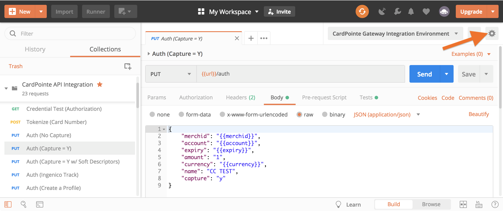
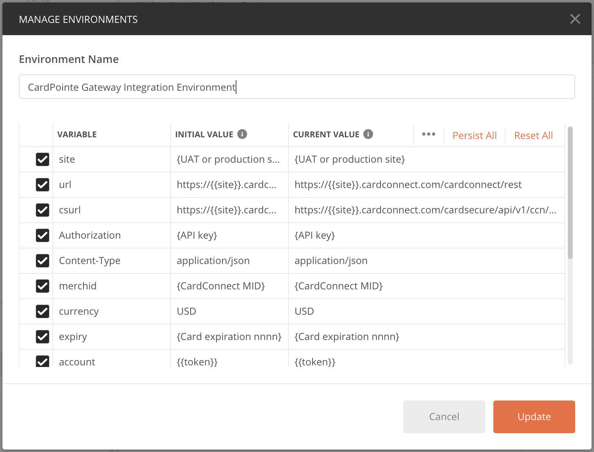

<!-- type: row -->

<!-- type: card
description: The following guides provide best practices and other supplemental information for integrating the CardPointe Gateway API.

-->

<!-- type: row-end -->

# Running the API in Postman

To help you get started with your integration, you can use the sample CardPointe Gateway API Integration Postman Collection, which includes a template of the API service endpoints.

The CardPointe Gateway API Integration collection also includes a sample Environment to help you get familiar with the API. See Configuring Your Postman Environment, below, for more information.

Click the button below to download the CardPointe Gateway API Integration collection:

[Run in Postman](https://app.getpostman.com/run-collection/b88a17df4b7a2b5667d2#?env%5BCardPointe%20Gateway%20Integration%20Environment%5D=W3sia2V5Ijoic2l0ZSIsInZhbHVlIjoie1VBVCBvciBwcm9kdWN0aW9uIHNpdGV9IiwiZW5hYmxlZCI6dHJ1ZX0seyJrZXkiOiJ1cmwiLCJ2YWx1ZSI6Imh0dHBzOi8ve3tzaXRlfX0uY2FyZGNvbm5lY3QuY29tL2NhcmRjb25uZWN0L3Jlc3QiLCJlbmFibGVkIjp0cnVlfSx7ImtleSI6ImNzdXJsIiwidmFsdWUiOiJodHRwczovL3t7c2l0ZX19LmNhcmRjb25uZWN0LmNvbS9jYXJkc2VjdXJlL2FwaS92MS9jY24vdG9rZW5pemUiLCJlbmFibGVkIjp0cnVlfSx7ImtleSI6IkF1dGhvcml6YXRpb24iLCJ2YWx1ZSI6IntBUEkga2V5fSIsImVuYWJsZWQiOnRydWV9LHsia2V5IjoiQ29udGVudC1UeXBlIiwidmFsdWUiOiJhcHBsaWNhdGlvbi9qc29uIiwiZW5hYmxlZCI6dHJ1ZX0seyJrZXkiOiJtZXJjaGlkIiwidmFsdWUiOiJ7Q2FyZENvbm5lY3QgTUlEfSIsImVuYWJsZWQiOnRydWV9LHsia2V5IjoiY3VycmVuY3kiLCJ2YWx1ZSI6IlVTRCIsImVuYWJsZWQiOnRydWV9LHsia2V5IjoiZXhwaXJ5IiwidmFsdWUiOiJ7Q2FyZCBleHBpcmF0aW9uIG5ubm59IiwiZW5hYmxlZCI6dHJ1ZX0seyJrZXkiOiJhY2NvdW50IiwidmFsdWUiOiJ7e3Rva2VufX0iLCJlbmFibGVkIjp0cnVlfSx7ImtleSI6InRva2VuIiwidmFsdWUiOm51bGwsImVuYWJsZWQiOnRydWV9LHsia2V5IjoicmV0cmVmIiwidmFsdWUiOiIiLCJlbmFibGVkIjp0cnVlfSx7ImtleSI6InByb2ZpbGVpZCIsInZhbHVlIjpudWxsLCJlbmFibGVkIjp0cnVlfSx7ImtleSI6ImFjY3RpZCIsInZhbHVlIjpudWxsLCJlbmFibGVkIjp0cnVlfSx7ImtleSI6ImJhdGNoaWQiLCJ2YWx1ZSI6bnVsbCwiZW5hYmxlZCI6dHJ1ZX0seyJrZXkiOiJkYXRlIiwidmFsdWUiOiIiLCJlbmFibGVkIjp0cnVlfV0=)

## Configuring Your Postman Environment

Environment variables allow you to autofill select fields with pre-configured values. For example, instead of manually specifying your merchant ID in the body of each request, you can set the `{{merchantid}}` variable to your specific MID.

Once you have received API credentials , you can configure the following variables to auto-fill your merchant-specific data in requests to the CardPointe Gateway API:

- **site** - Set this value to the site for the test or production environment.
- **url** - The `{{url}}` variable is used to set the base url (`https://{{site}}.cardconnect.com/cardconnect/rest/`) for the CardPointe Gateway RESTful web services. `{{site}}` is populated with the value you set for that variable.
- **csurl** - The `{{csurl}}` variable is used to set the url  (`https://{{site}}.cardconnect.com/cardsecure/api/v1/ccn/tokenize`) for the CardSecure tokenize REST web service. `{{site}}` is populated with the value you set for that variable.
- **Authorization** - Set this value to the Base64-encoded API credentials that you received. The `{{Authorization}}` variable is used in the header of every request.
- **merchid** - Set this value to your merchant ID (MID). The `{{merchid}}` variable is used in the body of most requests.

These variables are required in the header and body of most requests. The sample environment includes additional variables that you can configure when testing your integration.

Additionally, the sample collection includes test scripts, which gather specific values (such as `token`) from the response body, and dynamically update the corresponding environment variable.

To configure environment variables, do the following in Postman:

1) Click the gear icon to open the Manage Environments menu.

<!-- align: center -->


2) On the Manage Environments menu, enter your merchant-specific values for each variable.

<!-- align: center -->


3) Click **Update**

<!-- theme: warning -->
> See the [Postman user documentation](https://learning.postman.com/docs/introduction/overview/) for detailed information on using Postman to test APIs.

# Testing Your Integration

This guide provides information to help you develop and test your integrated application. Whether you are developing a new application, or maintaining an existing one, you should incorporate continuous testing in your SDLC.

<!-- theme: warning -->
> As we continue to update and improve the CardPointe Gateway, you should regularly schedule regression testing to ensure that your application utilizes and is compatible with applicable changes to the Gateway.

## Understanding the UAT Environment

You use the UAT (user acceptance testing) sandbox environment to test and validate your application. When you begin your application development and integration, you connect to the UAT instance of the CardPointe Gateway.

To connect to the UAT environment, your application uses the following URL:

`https://<site>-uat.cardconnect.com/cardconnect/rest/<endpoint>`

where <site> is the site name provided to you, and <endpoint> is a CardPointe Gateway service endpoint.

The UAT environment includes emulators that simulate the payment processing activities that occur in production. In this environment, you test with dummy data that is never sent to the payment processor. You should use test card numbers (for example, 4111 1111 1111 1111 or 4444 3333 2222 1111) and physical test cards. 

## UAT Request Rate Limiting

In the UAT environment, requests to the following endpoints are rate-limited: 

- `funding`

- `inquire`

- `profile`

- `settlestat`

Requests to these UAT endpoints are limited to **20 transactions per minute** (TPM), by IP address.

Responses from these endpoints in the UAT environment include the following rate-limit header fields:

`X-Rate-Limit-Retry-After-Seconds:` - Returned for unsuccessful `HTTP 429 Too Many Requests` responses when the limit has been reached. Specifies the seconds remaining before the limit resets.
`X-Rate-Limit-Remaining:` - Returned for successful `HTTP 200 OK` responses. Specifies the number of requests available before the limit is reached.

## Understanding UAT Responses

Data that you transmit to the UAT environment is never sent to the payment processing networks; instead, the CardPointe Gateway communicates with an emulator that simulates the payment processor that your merchant ID uses to process payments. The emulator mimics the behavior of the given processing host, and returns a response similar to what you would receive for a live transaction in the production environment.

CardPointe Gateway API responses returned in the UAT environment include fields and arrays in a randomized order. Additionally, UAT responses include dummy fields, arrays, and values. This is intended to help clients develop integrated software that dynamically parses the response data, rather than expecting fields to be present in static positions within the response object. 

<!-- theme: warning -->
> See Ensuring Backwards Compatibility in the API Basics and Best Practices Guide for more information.

Some specific situations, such as a network timeout and specific decline scenarios, require specific input to initiate. See Test Cases, below, for more information on these specific scenarios.

See Gateway Response Codes for a complete list of all possible response codes for the CardPointe Gateway and each processor.

## Getting Started

To get started, contact integrationdelivery@fiserv.com to request the following test account details:

- **UAT Merchant ID (MID)** - A UAT test MID that you will use to authenticate requests and access the CardPointe dashboard for reporting.
- **UAT API Credentials** - A set of API credentials provisioned for your UAT MID, which you will use to authenticate your API requests.
- **UAT API URL** - A UAT CardPointe Gateway API URL that you will use to test your API requests.

<!-- theme: warning -->
> Once your integration has been validated for production use, you will receive unique credentials for use in the production environment. See the [Integration Process Overview](path?=../../../../docs/documentation/IntegrationProcessOverview.md) for more information.

## Using Test Payment Accounts

When testing in the UAT environment, you must use test cards (either physical cards or test card numbers).

<!-- theme: danger -->
> Never use actual cardholder data to test in the UAT environment.

### UAT Test Card Data

The UAT Merchant ID is boarded to the First Data North UAT environment. If you are testing with this MID, or your own MID that is boarded to the North or Rapid Connect platform, you can use the following test card data to test card-not-present transactions.

The UAT Test Zip Codes section below contains information on testing AVS responses for First Data North, Rapid Connect, and additional platforms.

<!--
type: tab
titles: UAT Test Card Numbers, UAT Test Card Numbers for Specific Responses, UAT Test Zip Codes, UAT Test CVV Numbers
-->

You can use the following test card data to test card-not-present payments on the First Data North or Rapid Connect emulator.

Any card number that meets the following requirements and passes Luhn check validation will return an approval response:

| Card Brand | PAN Prefix | PAN Length |
| ---------- | ---------- | ---------- |
| Visa | 4* | 16 |
| Mastercard | 51* through 55* | 16 |
| Amex | 34* or 37* | 15 |
| Discover | 6011*, 622*, 644* through 65* | 16 |
| Diners | 36* | 14 |
| JCB | 35* | 16 |

<!--
type: tab
-->

#### RPCT Responses

The following test cards return specific responses on the Rapid Connect UAT emulator:

| Test PAN | resptext Returned | respstat Returned | respproc Returned | respcode Returned | authcode Returned | 
| --- | --- | --- | --- | --- | --- |
| **VISA** | 
| 4788250000121443 | Approval | A | RPCT | 000 | PPS009 |
| 4387751111111020 | Call for authorization | C | RPCT | 107 | - |
| 4387751111111038 | Do not honor | C | RPCT | 100 | - |
| 4387751111111046 | Expired card | C | RPCT | 101 | - |
| 4387751111111053 | Decline | C | RPCT | 500 | - |
| **Mastercard** | 
| 5454545454545454 | Approval | A | RPCT | 000 | PPS010 |
| 5442981111111023 | Call for authorization | C | RPCT | 107 | - |
| 5442981111111031 | Do not honor | C | RPCT | 100 | - |
| 5442981111111049 | Expired card | C | RPCT | 101 | - |
| 5442981111111056 | Decline | C | RPCT | 500 | - |
| **AMEX** | 
| 371449635398431 | Approval | A | RPCT | 000 | PPS013 | 
| **Discover** | 
| 6011000995500000 | Approval | A | RPCT | 000 | PPS015 |
| 6011000995511122 | Call for authorization | C | RPCT | 107 | - |
| 6011000995511130 | Do not honor | C | RPCT | 100 | - |
| 6011000995511148 | Expired card | C | RPCT | 101 | - |
| 6011000995511155 | Decline | C | RPCT | 500 | - |
| **Diners** | 
| 36438999960016 | Approval | A | RPCT | 000 | PPS012 |
| **JCB** |
| 3528000000000007 | Approval | A | RPCT | 000 | PPS007 |

#### FNOR Responses

The following test cards return specific responses on the First Data North UAT emulator:

| Test PAN | resptext Returned | respstat Returned | respproc Returned | respcode Returned | authcode Returned | 
| --- | --- | --- | --- | --- | --- |
| **VISA** | 
| 4788250000121443 | Approval | A | FNOR | 00 | PPS009 |
| 4387751111111020 | Refer to issuer | C | FNOR | 01 | - |
| 4387751111111038 | Do not honor	| C | FNOR | 05 | - |
| 4387751111111046 | Wrong expiration	| C | FNOR | 54 | - |
| 4387751111111053 | Insufficient funds	| C | FNOR | NU | - |
| **Mastercard** |
| 5454545454545454 | Approval | A | FNOR | 00 | PPS010 |
| 5442981111111023 | Refer to issuer | C | FNOR | 01 | - |
| 5442981111111031 | Do not honor	| C | FNOR | 05 | - |
| 5442981111111049 | Wrong expiration	| C | FNOR | 54 | - |
| 5442981111111056 | Insufficient funds	| C | FNOR | NU | - |
| **AMEX** |
| 371449635398431 | Approval | A | FNOR | 00 | PPS013 |
| **Discover** |
| 6011000995500000 | Approval | A | FNOR | 00 | PPS015 |
| 6011000995511122 | Refer to issuer | C | FNOR | 01 | - |
| 6011000995511130 | Do not honor	| C | FNOR | 05 | - |
| 6011000995511148 | Wrong expiration	| C | FNOR | 54 | - |
| 6011000995511155 | Insufficient funds	| C | FNOR | NU | - |
| **Diners** |
| 36438999960016 | Approval | A | FNOR | 00 | PPS012 |
| **JCB** | 
| 3528000000000007 | Approval | A | FNOR | 00 | PPS007 |

<!--
type: tab
-->

The UAT environment is configured to return a specific AVS response when the last 3 characters of the postal code match one of the values in the table below. This emulation is available only for the following processors:

- First Data North (FNOR)
- First Data Rapid Connect (RPCT)
- First Data Nashville (NASH)
- Chase Paymentech (PMT)
- Paymentech Tampa (PTAM)
- American Express (AMEX) - US Zip Codes Only
- Vantiv (VANT) - US Zip Codes Only

**Chase Paymentech (PMT)**

| Last 3 of Postal Code | AVS Response | Description |
| --- | --- | --- |
| 1A1, 111 | I1 | Match |
| 1A2, 112 | I2 | Match |
| 1A3, 113 | I3 | Match |
| 1A4, 114 | I4 | Match |
| 1A5, 115 | I5 | No Match |
| 1A6, 116 | I6 | No Match |
| 1A7, 117 | I7 | No Match |
| 1A8, 118 | I8 | No Match |

**All Other Processors**

| Last 3 of Postal Code | AVS Response | Description |
| --- | --- | --- |
| 1A1, 224 | X | Address + Zip Match |
| 1A2, 225, 406	| Y | Address + Zip Match |
| 1A3, 111, 201 | A | Address Matches, Zip Does Not Match |
| 1A4, 223 | W | Zip Matches, Address Does Not Match |
| 1A5, 113, 226 | Z |	Zip Matches, Address Does Not Match |
| 1A6, 112, 214 |	N |	No Address or Zip Match |
|1A7, 221 |	U |	Address Unavailable |
| 1A8, 207 | G |	Issuer Does Not Participate | 
| 1A9, 218 | R | Issuer System Unavailable |
| 2B1, 205 | E | Error, AVS Check Not Performed |
| 2B2, 219 | S | Service Not Supported |
| 2B3, 228 | Q | Bill To Address Did Not Pass Edit Checks |
| 2B4, 204, 227	| D	| International Address + Postal Code Match |
| 2B5, 202 | B | International Address Matches, Postal Code Not Verified Due to Incompatible Format |
| 2B6, 203 | C | International Address + Postal Code Not Verified Due to Incompatible Formats |
| 2B7, 216 | P | International Postal Code Matches, Address Not Verified Due to Incompatible Format |
| 2B8, 209 | I | International Address Not Verified by Issuer |
| 2B9, 213 | M | International Address + Postal Code Match |

Any zip code or postal code not ending in a value listed above returns the default AVS response for that processor.

<!--
type: tab
-->

You can use the following test CVV numbers on the First Data North or Rapid Connect UAT emulator to test CVV verification:

| CVV Value |	CVV Response |
| --- | --- |
| 112 |	M (Match) |
| 111	| N (No Match) |
| 222	| P (Not Processed) |
| 333	| U (Unknown) |

<!-- type: tab-end -->

### Physical Test Cards

Physical test cards allow you to test card-present payments.

You can obtain a complete set of EMV test cards from B2 Payment Solutions at the following URL:

https://b2ps.com/product-category/b2-payment-testing-products/

## Test Cases

The following topics provide information for testing specific features to obtain responses that are otherwise not returned in the UAT environment.

### Testing with Amount-Driven Response Codes 

> This feature is available for the following emulators:
>
> - First Data North (FNOR) - Auth and Refund
> - First Data Rapid Connect (RPCT) - Auth and Refund
> - Chase Paymentech (PMT) - Auth and Refund
> - Paymentech Tampa (PTAM) - Auth
> - TSYS (VPS) - Auth
> - Vantiv - Auth and Refund

<!-- theme: warning -->
> See Gateway Response Codes for a complete list of possible response codes for the CardPointe Gateway and each processor.

When testing your CardPointe Gateway or CardPointe Integrated Terminal integration in the UAT environment, you can use amount-driven response codes to emulate processor-specific authorization responses that you might encounter in the production environment. This allows you to receive and handle response codes that you would not otherwise encounter in your test environment.

All response codes returned in the production environment are received directly from the processor.

To return a specific response code, you make an authorization request with an amount in the $1000-$1999 range. You specify the desired response code using the last three digits (with a leading 0 for 2-digit response codes) of the whole-dollar amount (the amount excluding cents). For example, if you want to return RPCT respcode 332, "Account locked," make an authorization request for $1332.

The following example illustrates an authorization request for $1116.95. The amount value specified is 111695 (with the decimal implied), therefore, the whole-dollar amount is $1116.

#### Sample Request

```json
{
	"amount" : "111695",
	"expiry" : "1220",
	"account" : "4000065433421984",
	"merchid" : "496160873888"
}
```

The response includes the RPCT respcode 116, which indicates that the transaction was declined due to insufficient funds.

#### Sample Response

```json
{
	"amount" : "0.00",
	"resptext" : "Not sufficient funds",
	"cardproc" : "RPCT",
	"respstat" : "C",
	"respcode" : "116"
}
```

### Testing Refund Authorizations

You can simulate a refund authorization response on the following UAT emulators:

- First Data North (FNOR)
- First Data Rapid Connect (RPCT)
- Chase Paymentech (PMT)
Similarly to testing specific authorization response scenarios using amount-driven responses, you can test individual refund response codes, by sending a partial refund request using an amount value that includes the desired response code.

> Like in Production, UAT transactions cannot be refunded until they have settled, unless the MID is enabled to refund unsettled transactions.

To test a refund decline, do the following:

1) Run an authorization request including `"capture":"y"` and `"amount":"2000.00"` or greater.
2) Run a refund request including the `retref` from the authorization response and `"amount":"1nnn.00"`, where `nnn` is the 2 (including leading 0) or 3-digit decline response code you want to receive.

    For example, to return a RPCT 500 "Decline" response, include `"amount":"1500.00"` in the refund request.

### Testing Partial Authorizations

You can simulate a partial authorization response on the following UAT emulators:

- First Data North (FNOR)
- First Data Rapid Connect (RPCT)
- Paymentech (Paymentech)
- Paymentech Tampa (PTAM)
- Vantiv (VANT)
- Worldpay (VPS)

To simulate a partial authorization, submit an authorization request using `"account":"4387750101010101"` and `"amount":"6.00"` or greater.

The following responses are returned:

| respproc | respcode | respstat | resptext | amount |
| --- | --- | --- | --- | --- |
| FNOR | 10 | A | Partial Approval | 5.00 |
| PMT | 100 | A | Approval | 5.00 |
| PTAM | 10 | A | Partial Approval | 5.00 |
| RPCT | 002 | A | Approve for Partial Amount | 5.00 |
| VANT | 10 | A | Partial Approval | 5.00 |
| VPS | 10 | A | Partial Approval | 5.00 |

For example: 

#### Sample Partial Authorization Request

```json
{
	"amount" : "6.50",
	"expiry" : "1220",
	"account" : "4387750101010101",
	"merchid" : "496160873888"
}
```

#### Sample Partial Authorization Response

```json
{
	"amount" : "5.00",
	"resptext" : "Partial Approval",
	"cardproc" : "FNOR",
	"respstat" : "A",
	"respcode" : "10"
}
```

### Testing AVS Response Codes

> This feature is available for the following emulators:
>  
> - First Data North (FNOR)
> - First Data Rapid Connect (RPCT)
> - First Data Nashville (NASH)
> - Chase Paymentech (PMT)
> - Paymentech Tampa (PTAM)
> - American Express (AMEX)
> - Vantiv (VANT)

In order to test AVS response codes that you will encounter in the production environment, the UAT environment is configured to simulate various AVS responses when the **last three** characters of the `postal` code matches a specific value.

To force a specific AVS response, review the **UAT Test Zip Codes** available in the UAT Test Card Data section of this guide. Then submit an authorization request using the last three characters of the postal code meant to generate that AVS response. To illustrate this, the example below uses a zip code ending in 112 to emulate `"avsresp": "N"` in the response.

> Additionally, including any 3-digit AVS response code within the `address` field AVS response will also trigger that response. For example, an authorization request with `"address": "112 Main Street"` or `"address": "31125 Main Street"` will trigger the same AVS response as when using 112 as the last three characters of the postal code.
>
> To ensure that you receive the intended AVS response, only include a valid 3-digit response value in either the `address` or `postal` field, not both. For example, if using the `postal` field to test AVS responses, ensure that the `address` field does not also contain an AVS response code.

#### Sample Request

```json
{
  "merchid": "123456789012",
  "account": "6011000995500000",
  "expiry": "1218",
  "amount": "11.11",
  "address": "123 MAIN STREET",
  "postal": "55112"
}
```

#### Sample Response

```json
{
  "respstat": "A",
  "token": "9601616143390000",
  "retref": "316336153961",
  "amount": "11.11",
  "expiry": "1218",  
  "merchid": "123456789012",
  "respcode": "00",
  "resptext": "Approved",
  "respproc": "FNOR",
  "avsresp": "N"
}
```

<!-- theme: warning -->
> The UAT environment also accepts and simulates AVS response codes for alphanumeric postal codes. Be sure to include the country field in your request when providing an alphanumeric postal code, as omitting this field will cause the country to default to US and potentially produce unexpected results.
>
> Note that the following processors do not support AVS for international addresses:
>
> - American Express (AMEX)
> - Vantiv (VANT)

### Testing CardPointe Gateway Timeouts

> This feature is only available for the First Data Rapid Connect (RPCT) and First Data North (FNOR) emulators.

Because the UAT environment does not communicate with the processing hosts, your application can not encounter a time out scenario. In production, when the CardPointe Gateway communication with the processor times out, the Gateway returns an auth response object that includes `"respcode":"62"` and `"resptext":"Timed out"`

If you want to test your application's ability to handle a time out response, you can send an auth request using one of the following test card numbers:

- **Visa**: 4999006200620062
- **MC**: 5111006200620062
- **Discover**: 6465006200620062
 
<!-- theme: warning -->
> You can also tokenize the card number and use the token in the auth request.

#### Example Request

```json
{
    "merchid" : "496160873888",
    "account" : "4999006200620062",
    "expiry" : "1223",
    "amount" : "5.00",
    "capture" : "y"
}
```

The response includes the PPS respcode 62, which indicates that the transaction was declined due to a communication timeout between the CardPointe Gateway and processor host.

#### Example Response

```json
Status: 200 OK
 
{
    "amount" : "5.00",
    "resptext" : "Timed out",
    "setlstat" : "Declined",
    "respcode" : "62",
    "merchid" : "496160873888",
    "token" : "9497267302710062",
    "respproc" : "PPS",
    "retref" : "343005123105",
    "respstat" : "B",
    "account" : "9497267302710062"
}
```

# Processing ACH Payments

This guide provides guidance for accepting Automated Clearing House (ACH) payments using the CardPointe Gateway API. ACH payments, also called e-check payments, are a common payment method for recurring payments as well as telephone and mail orders.

Unlike credit card payments, when a customer authorizes an ACH payment, the funds are withdrawn directly from his or her bank account. This process can take several days, so you should include a monitoring process in your integration to verify the status of the transaction.

To accept ACH payments, you must capture and handle the customer's bank account and routing number. While you can capture this information and pass it directly to the CardPointe Gateway in an authorization request, it is a best practice to instead capture this information and tokenize it using a CardSecure-integrated web form.

## Using a Web Form to Gather and Tokenize ACH Payment Data 

To ensure the security of your customers' data, as well as your PCI compliance, it is recommended that you use a customer-facing web form, integrated with CardSecure, to capture and tokenize bank account and routing information.

When using a web form to capture and tokenize customer bank account information, include separate fields for the routing number and account number. Send these fields in a CardSecure tokenization request in the format
`"account" : "<routing number>/<account number>"`

For example:

`"account" : "123456789/1234123412341234"`

CardSecure returns a token representing the ACH account information, which you can then use to make an authorization request to the CardPointe Gateway.

## Making an ACH Authorization Request

To process an ACH payment, you make an authorization request using the CardPointe Gateway API. In addition to the fields required for all authorization requests, you must include the following information:

| Payment Information | Authorization Request Parameter | Description |
| --- | --- | --- |
| Account and Routing Numbers | `account` and `bankaba` | If you gathered and tokenized the customer's bank account and routing information using a CardSecure-integrated web form, then you can pass the token in the `account` field. <br> <br> If you are handling the clear account number and routing number, then include them in the `account` and `bankaba` fields, respectively. |
| Payment Origin | `ecomind` | For ProfitStars ACH transactions, specifies the Standard Entry Class (SEC) code for the transaction. <br> <br> Optionally, include one of the following values (defaults to `E` if not specified): <br> <br> `"ecomind" : "T"` - SEC code TEL (Telephone) for a single or recurring payment with recorded verbal consent. <br> `"ecomind" : "B"` - SEC code PPD (prearranged) for a single or recurring payment with written consent.  <br> `"ecomind" : "E"` - SEC code WEB for an Internet or mobile payment. |
| Account Type | `accttype` | Include one of the following values: <br> <br> `"accttype" : "ECHK"` for a checking account <br> `"accttype" : "ESAV"` for a savings account |

The following example illustrates an ACH authorization request and response:

#### Example ACH Request and Successful Response

```json
PUT /cardconnect/rest/auth HTTP/1.1
Host: <site>
Authorization: Basic {base64-encoded credentials}
Content-Type: application/json

{
  "merchid":"496160873888",
  "account": "9036412947515678",
  "accttype": "ECHK",
  "amount" : "1000",
  "ecomind": "E",  
  "capture" : "y"
}

HTTP/1.1 200 OK
Content-Type: application/json

{
   "amount": "10.00",
   "resptext": "Success",
   "cvvresp": "U",
   "respcode": "00",
   "batchid": "1900940972",
   "avsresp": "U",
   "merchid": "542041",
   "token": "9036412947515678",
   "authcode": "VPJSP5",
   "respproc": "PSTR",
   "retref": "353318135488",
   "respstat": "A",
   "account": "9036412947515678"
}
```

## Verifying ACH Transactions

ACH transactions typically take several business days to process and settle, therefore, it is a best practice to periodically check the status of the transaction to ensure that it is successfully processed and that you are credited for the authorized amount.

You can use the CardSecure Gateway API to programmatically verify the transaction status using the inquire and funding service endpoints.

### Using the Inquire Endpoint

The inquire endpoint provides information on completed authorizations.

You can use the inquire endpoint if you have the retrieval reference number (`retref`) from the authorization response. If you don't have the `retref`, but you included a unique order ID in the authorization request, then you can use the inquireByOrderId endpoint instead.

The inquire response includes a settlement status (`setlstat`) field that displays the settlement status of the transaction. Note that the settlement status initially displays "Queued for Capture" for ACH transactions, and the value is updated once the batch is transmitted. If `"setlstat" : "rejected"` you can use the funding endpoint to gather more detailed information.

### Using the Funding Endpoint

The funding endpoint provides additional useful information for ACH transactions. Specifically, you can use the funding endpoint to retrieve an ACH return code (`achreturncode`), which provides additional information for rejected ACH transactions.

To use the funding endpoint, you make a request using the merchant ID and the date of the funding event that included the transaction. The funding endpoint returns an array of transaction details for that date.

Use the `retref` for the ACH transaction to locate it in the txns node of the response data. For ACH transactions, the response includes an `achreturncode` field that includes a specific code that explains the reason for the rejection.

The following table describes the possible ACH return code values.

<!--
type: tab
titles: ACH Return Codes
-->

The following codes are returned when an ACH transaction is rejected. 

| Code | Description|
| --- | --- |
| R01 | Insufficient funds |
| R02 | Bank account closed |
| R03 | No bank account/unable to locate account |
| R04 | Invalid bank account number |
| R06 | Returned per ODFI request |
| R07 | Authorization revoked by customer |
| R08 | Payment stopped |
| R09 | Uncollected funds |
| R10 | Customer advises not authorized |
| R11 | Check truncation entry return |
| R12 | Branch sold to another RDFI |
| R13 | RDFI not qualified to participate |
| R14 | Representative payee deceased or unable to continue in that capacity |
| R15 | Beneficiary or bank account holder |
| R16 | Bank account frozen |
| R17 | File record edit criteria |
| R18 | Improper effective entry date |
| R19 | Amount field error | 
| R20 | Non-payment bank account |
| R21 | Invalid company ID number |
| R22 | Invalid individual ID number |
| R23 | Credit entry refused by receiver |
| R24 | Duplicate entry |
| R25 | Addenda error |
| R26 | Mandatory field error |
| R27 | Trace number error |
| R28 | Transit routing number check digit error |
| R29 | Corporate customer advises not authorized |
| R30 | RDFI not participant in check truncation program |
| R31 | Permissible return entry (CCD and CTX only) |
| R32 | RDFI non-settlement |
| R33 | Return of XCK entry |
| R34 | Limited participation RDFI |
| R35 | Return of improper debit entry |
| R36 |	Return of Improper Credit Entry |
| R39 |	Improper Source Document |
| R40 |	Non-Participant in ENR program |
| R41 |	Invalid transaction code |
| R42 |	Transit/Routing check digit error |
| R43 |	Invalid DFI account number |
| R44 |	Invalid individual ID number |
| R45 |	Invalid individual name |
| R46 |	Invalid representative payee indicator |
| R47 |	Duplicate enrollment |
| R50 |	State Law affecting RCK Acceptance |
| R51 |	Item is Ineligible, Notice Not Provided, Signature Not Genuine, or Item Altered (adjustment entries) |
| R52 |	Stop Payment on Item (adjustment entries) |
| R61 |	Misrouted return |
| R62 |	Incorrect trace number |
| R63	| Incorrect dollar amount |
| R64 |	Incorrect individual identification |
| R65 |	Incorrect transaction code |
| R66 |	Incorrect company identification |
| R67 |	Duplicate return |
| R68 |	Untimely return |
| R69 |	Multiple errors |
| R70 |	Permissible return entry not accepted |
| R71 |	Misrouted dishonored return |
| R72	| Untimely dishonored return |
| R73 |	Timely original return |
| R74 |	Corrected return |
| R80 |	Cross Border Payment Coding Error |
| R81 |	Non-Participant in Cross-Border Program |
| R82 |	Invalid Foreign Receiving DFI identification |
| R83	| Foreign Receiving DFI Unable to Settle |

<!-- type: tab-end -->

## Testing ACH Authorizations

To test ACH authorizations, you can use the test Merchant ID (MID) 496160873888 in the CardPointe Gateway's UAT environment. This MID uses a routing rule to detect when `"accttype" : "ECHK"` and then routes ACH transactions through a separate, linked MID, 542041.

This configuration allows you to dedicate separate merchant accounts to processing credit/debit and ACH transactions, which can be helpful for testing and reporting purposes. Contact Support if you want to configure a dedicated MID for processing ACH transactions.

<!-- theme: warning -->
> To test ACH transactions, you must use a valid ABA routing number (for example, 036001808 or 011401533); however any account number is accepted. 
>
> If you test with an invalid routing number, the response returns a `resptext` of "The RoutingNumber (<bankaba>) is not a valid routing number."

# Scheduling Recurring Payments

This guide provides information for extending your existing CardPointe Gateway API integration to add recurring billing to your payment methods.

To do this, you can use an application scheduler, like Cron, to create a schedule to run recurring transactions. The scheduled job can initiate an authorization request to the CardPointe Gateway using tokenized payment data or a stored profile.

This method gives you complete control over your recurring payment schedule with a simple API integration.

<!--theme: danger -->
> - It is a violation of PCI DSS standards to store Card Verification Value (CVV) data. Neither The CardPointe Gateway nor the merchant can store this data for the purpose of recurring billing.
>
> - When establishing recurring billing payments or storing and using cardholder payment information for future payments, you must ensure that you obtain the cardholder's consent, and that you comply with the requirements documented in the Visa and Mastercard Stored Credential Transaction Framework guide. Note that this feature is currently only available for merchants processing on the First Data Rapid Connect platform. See the Visa and Mastercard Stored Credential Transaction Framework guide for updates on support for additional processors, and detailed information for integrating and testing these changes.

## How it Works

The following process provides a general overview of the steps required to set up a recurring payment schedule using the CardPointe Gateway. depending on your integration and business needs, your procedure may vary.

Ensure that you review and comply with the card brand requirements for obtaining consent to store and reuse cardholder data. See the Visa and Mastercard Stored Credential Framework Mandate guide for detailed information.

1) Tokenize the customer's payment data.

    Depending on your existing integration, there are several ways to tokenize payment data.

    For example, you can:
    - Use the customer’s clear PAN or ACH payment data to make a CardPointe Gateway API authorization request. The response returns a token for the account.

       **Note**: _You should only programmatically handle and tokenize clear payment account numbers (PANs) if your business is a registered PCI Level 1 or Level 2 certified merchant. If you are not already certified for compliance with the Payment Card Industry's standards and guidelines for handling sensitive account data, see https://www.pcisecuritystandards.org/ for more information._

       Optionally, do the following: 

       - Include ”capture” : “y” to accept an initial payment.
       - include ”profile” : “y” to store the customer’s data in a profile to use in future requests.
    - Gather and tokenize the payment card data using the Hosted iFrame Tokenizer.
    - Use a CardPointe Integrated Terminal and the Terminal API readCard or readManual service endpoint.

2) Store the token for reuse.

    You can either store tokens and customer data in your own database, or you can use the CardPointe Gateway API’s profile service endpoint to create and store customer profiles in the CardPointe Gateway's secure vault. You can skip this step if you created a profile in step 1.
   
3) Gather your billing requirements.

    Determine the start date and length of the billing plan, the payment amount and frequency, and any additional information that you'll need to include in your requests.

4) Build your Cron job to schedule authorization requests to the CardPointe Gateway API.

> Authorization requests for recurring billing payments **must** include the following values:
>
> - `"ecomind" : "R"` - to flag these authorizations as recurring billing. If this parameter is not set, recurring payments will be declined.
> - `"cof" : "M"` - to identify these authorizations as merchant-initiated stored credential transactions. <br> Note that this field is currently only supported for First Data Rapid Connect merchants.
> - `"cofscheduled" : "Y"` - to identify these as recurring transactions using stored credentials. Note that this field is currently only supported for First Data Rapid Connect merchants.

#### Example Recurring Billing Payment Authorization Using a Stored Profile

```json
PUT /cardconnect/rest/auth HTTP/1.1
Host: <site>
Authorization: Basic {base64-encoded credentials}
Content-Type: application/json

{
  "merchid" : "MID",
  "ecomind" : "R",
  "cof" : "M",
  "cofscheduled" : "Y"
  "profile" : "18854390708079407191/1",
  "expiry" : "1218",
  "amount" : "500",
  "capture" : "Y"
}
```

# Printing Receipts Using Authorization Data

This guide provides information for integrators who want to use authorization response data to print receipts from an integrated POS printer.

## Receipt Rules and Requirements

This topic provides general best practices and integration details for printing receipts and capturing cardholder signature data; however, each card brand provides specific rules and requirements. You should understand and follow the receipt guidelines for the card brands that you accept.

Consult the following card brand guidelines for detailed information:

- **MasterCard**: https://www.mastercard.us/content/dam/mccom/global/documents/transaction-processing-rules.pdf
- **Visa**: https://usa.visa.com/dam/VCOM/download/about-visa/visa-rules-public.pdf
Additionally, receipt requirements vary depending on the card type. For example, receipts generated for EMV (chip and contactless) card transactions must include specific EMV tag data returned in the authorization response. Ensure that you understand the requirements for accepting both EMV and MSR (magnetic-stripe) cards as determined by the card brands.

## Understanding Receipt Data

When an authorization is successfully approved and processed by the CardPointe Gateway, the authorization response payload includes important transaction details that you can capture and print on a receipt.

In general, a receipt must include:

- transaction details from the authorization response
- merchant account information and additional transaction details returned in the receipt object
- EMV tag data returned in the EMV tag object, if the card used was an EMV (chip or contactless) card.

## Authorization Response Data

A successful authorization response includes the following fields. You should include the highlighted fields on your receipts.

| Field | Content | Max Length | Comments |
| --- | --- | --- | --- |
| respstat | Status | 1 | Indicates the status of the authorization request. Can be one of the following values: <br> <br> A - Approved <br> B - Retry <br> C - Declined |
| retref | Retrieval reference number | 12 | CardPointe retrieval reference number from authorization response |
| account | Account number | 19 | Copied from the authorization request, masked except for the last four digits. |
| token (if requested) | Token | 19 | A token that replaces the card number in capture and settlement requests if requested |
| amount | Amount | 12 | Authorized amount. Same as the request amount for most approvals. <br> The amount remaining on the card for prepaid/gift cards if partial authorization is enabled. <br> Not relevant for declines. |
| batchid | Batch ID | 12 | Automatically created and assigned unless otherwise specified. Returned for a successful authorization with capture. |
| orderid | Order ID | 19 | Order ID copied from the authorization request. |
| merchid | Merchant ID | 12 | Copied from the authorization request. <br> **Note**: _If you include the merchant ID on a receipt, mask this value, except the last four digits_. |
| respcode | Response code | - | Alpha-numeric response code that represents the description of the response |
| resptext | Response text | - | Text description of response |
| respproc | Response processor | 4 | Abbreviation that represents the platform and the processor for the transaction |
| bintype | Type of BIN | 16 | **Possible Values**: <br> <br> Corp <br> FSA+Prepaid <br> GSA+Purchase <br> Prepaid <br> Prepaid+Corp <br> Prepaid+Purchase <br> Purchase |
| entrymode | POS Entry Mode | 25 | Only returned for merchants using the First Data North and RapidConnect front end platforms. <br> **Possible Values**: <br> <br> Keyed <br> Moto <br> ECommerce <br> Recurring <br> Swipe(Non EMV) <br> DigitalWallet <br> EMVContact <br> Contactless <br> Fallback to Swipe <br> Fallback to Keyed |
| avsresp | AVS response code | 2 | Alpha-numeric AVS response. |
| cvvresp | CVV response code | 1 | Alpha-numeric CVV response. |
| authcode | Authorization code | 6 | Authorization Code from the Issuer |
| signature | Signature Bitmap | 6144 | JSON escaped, Base64 encoded, Gzipped, BMP file representing the cardholder's signature. Returned if the authorization used a token that had associated signature data or track data with embedded signature data. <br> <br> If you are integrating a custom receipt solution, you can convert this image file and print it to the receipt, if required. |
| commcard | Commercial card flag | 1 | **Y** if a Corporate or Purchase Card |
| emv | Cryptogram | - | Authorization Response Cryptogram (ARPC). This is returned only when EMV data is present within the Track Parameter. |
| emvTagData | EMV tag data | 2000 | A string of receipt and EMV tag data (when applicable) returned from the processor. <br> <br> This data returned should be presented on a receipt if applicable, and recorded with the transaction details for future reference. <br> <br> Refer to EMV Tag Data below for a list of the possible fields returned. |
| receipt | receipt data | - | An object that includes additional fields to be printed on a receipt. <br> <br> Refer to Receipt Data below for a list of the fields returned. |

## EMV Tag Data

If the card used in the authorization request was an EMV (chip or contactless) card, then the response data includes an **emvTagData** object with the following fields:

| Name | Tag | Details | Source | Format | Max Length |
| --- | --- | --- | --- | --- | --- |
| TVR (Terminal Verification Results) | 95 | Status of the different functions as seen from the terminal | Terminal | Binary | 5 |
| ARC (Authorization Response Code) | 8A | Indicates the transaction disposition of the transaction received from the issuer for online authorizations.	| Issuer/Terminal | String | 2 |
| PIN (CVM Results) | 9F34 | Indicates the results of the last CVM performed. If PIN was entered, returns "Verified by PIN"	| Terminal | String | 15 |
| Signature (CVM Results) | 9F34 | Indicates the results of the last CVM performed. If "true" then CVM supports signature and signature line may be applicable. However, card brands have moved away from requiring signature for EMV transactions. | Terminal | Boolean | 5 |
| Mode | - | Identifies the mode used to authorize (or decline) the transaction. Always "Issuer" | CardPointe Gateway | String | 6 | 
| TSI (Transaction Status Information) | 9B | Indicates the functions performed in a transaction | Terminal | Binary | 2 |
| Application Preferred Name | 9F12 | Preferred mnemonic associated with the AID. If unavailable, use Application Label. | Card | String | 16 |
| AID (Application Identifier, Terminal) | 9F06 | Identifies the application as described in ISO/IEC 7816-5	| Terminal | Binary | 16 |
| IAD (Issuer Application Data) | 9F10 | Contains proprietary application data for transmission to the issuer in an online transaction.	| Card | Binary | 32 |
| Entry method | - | Indicator identifying how the card information was obtained.	| Terminal | String | 26 |
| Application Label | 50 | Mnemonic associated with the AID according to ISO/IEC 7816-5. If unavailable, use the Application Preferred Name. | Card | String (with the special character limited to space) | 16 | 

## Receipt Data

The `receipt` object is an optional set of fields that provides additional merchant and order details in the authorization response. 

<!-- theme: warning -->
> To include the `receipt` object in the authorization response, you must specify `"receipt":"Y"` in the authorization request. 

The merchant account information is populated using the merchant properties configured for the MID.

Additionally, this object includes additional transaction details from the authorization response. You can optionally include a custom order note (orderNote) and item details (items), by including a userFields object in the authorization request.

You can specify the following fields in a userFields object to include an order note or item details, or to override the merchant properties:

| Field | Description |
| --- | --- |
| receiptOrderNote	| Use this field to provide a custom note to include on the receipt. |
| receiptItems	| Use this field to provide custom item descriptors to include on the receipt. |
| receiptHeader	| Use this field to override the header configured for your MID. |
| receiptFooter	| Use this field to override the footer configured for your MID. |
| receiptDba	| Use this field to override the DBA name configured for your MID. |
| receiptPhone	| Use this field to override the phone number configured for your MID. |
| receiptAddress1 |	Use this field to override the address (line 1) configured for your MID. |
| receiptAddress2	| Use this field to override the address (line 1) configured for your MID. |

Each value can be any string and the total length of user defined fields (URL/JSON-encoded) is limited to 4000 bytes. See the description of userFields in the CardPointe Gateway API documentation for more information.

> Contact isvhelpdesk@cardconnect.com for assistance configuring the receipt printing properties for your merchant account.

A successful authorization response includes a receipt object with the following fields:

| Field | Format | Description |
| --- | --- | --- |
| header | AN |	A customizable field to display an alphanumeric message. For example, a specific terms, disclosure, or cardholder agreement statement. |
| footer | AN | A customizable field to display an alphanumeric message. For example, a specific terms, disclosure, or cardholder agreement statement. |
| dba |	AN | The merchant's Doing Business As (DBA) name. |
| address1 | AN |	Line 1 of the merchant's address. |
| address2 | AN |	Line 2 of the merchant's address. |
| phone |	N	| The merchant's phone number. |
| dateTime | N | The date and time of the transaction (YYYYMMDDHHMMSS). |
| nameOnCard | A | The Cardholder's name, if included in the authorization request. |
| orderNote |	AN | A custom order note, if included in the userFields in the authorization request. |
| items |	AN | A custom item descriptor, if included in the userFields in the authorization request. |

### Printing a Receipt

To print a receipt from your custom integration, use the fields described in Understanding Receipt Data to build your receipt template.

The following example illustrates a receipt template (left) and a receipt populated with data retrieved from the authorization response (right).

<!-- align: center -->


# Handling Timed-out Transactions

This guide provides best practices for handling CardPointe Gateway API timeout errors. The Gateway API supports synchronous communication; therefore, your application must make requests and expect responses in sync with the CardPointe Gateway services.

If you are a developer integrating your point-of-sale software with the CardPointe Gateway API, it is important for you to understand how long the steps of the payment process can take, so your software can interact accordingly. The following information should guide you on how long to wait for a response, and actions to take if one is not returned.

## CardPointe Gateway Authorization Timeout (32 Seconds)

When you use the CardPointe Gateway API's auth endpoint, to make an authorization request, the Gateway sends the request to the payment processing network and allows 31 seconds for a response. If the Gateway does not receive a response, then the request times out at the 32 second mark and returns a "Timed Out" response.

## Handling CardePointe Gateway Timeouts

Whether your application is using the Terminal API authCard request, or the CardPointe Gateway API auth request, it should be designed to handle the following scenarios:

1) A "Timed out" response returned successfully (HTTP 200) from the CardPointe Gateway auth endpoint or the Terminal API authCard endpoint.

2) No response returned successfully from the CardPointe Gateway auth endpoint.

#### Timed Out Response

```json
Status: 200 OK 
   {    
    "amount":"685.00",
    "resptext":"Timed out",
    "setlstat":"Declined",
    "acctid":"1",    
    "respcode":"62",    
    "merchid":"123456789012",    
    "token":"9441282699177251",    
    "respproc":"PPS",    
    "name":"Jane Doe",    
    "currency":"USD",    
    "retref":"343005123105",    
    "respstat":"B",    
    "account":"9419786452781111"
   }
```

In this case, a response, including a `retref` for the transaction, is returned. The response includes `"respstat": "B"` which always means "Retry." The transaction attempt should be tried again.

If you need to reference the details of any particular transaction attempt, supply valid `retref` and `merchid` values in an inquire request.

In some cases, retry attempts will also fail. In the event of multiple retry failures, check status.cardconnect.com for reports of system-wide issues.

### No Response Returned

This scenario may include, but is not limited to, an HTTP Status 408 Request Timeout.

In this case, your application can not determine whether or not the transaction was successful.

As a safeguard against losing record of the transaction attempt from your system, it is strongly recommended that you supply a unique order ID for every authorization request made to the API.

If you included an order ID in the original authorization request, then you can use the following Gateway API service endpoints to inquire on or void the transaction record:

- **inquireByOrderid**
  
	The inquireByOrderid endpoint is used to look up a transaction record using the order ID supplied in the original authorization request. If the supplied order ID is found, then the same payload returned in the inquire response is provided.

	If the original authorization request was successful, the response includes the transaction details, including the `retref`. You can then use the `retref` to make a subsequent void or capture call.

	If the original authorization request was unsuccessful, the response includes PPS respcode 29, `Txn not found`. This response indicates that the authorization request timed out before being processed by the CardPointe Gateway, and you should retry the authorization request.

- **voidByOrderId**

	The voidByOrderId endpoint is used to look up **and** void a transaction record using the order ID supplied in the original authorization request. If the supplied order ID matches a transaction record, the authorization is voided and a void response is returned. See the voidByOrderId description for more information.

	voidByOrderId should be used in the event that no response is returned by an inquireByOrderId request, or if no look up is required at all.

	**Note**: _You should attempt the voidByOrderid request three times (3x) to ensure that the transaction is voided, despite not receiving a response to indicate that the request was successful._
  
See the CardPointe Gateway API for information on the inquireByOrderid, voidByOrderId, and capture service endpoints.

# Manually Managing Gateway Batches

This guide provides information for using the CardPointe Gateway API's openbatch and closebatch service endpoints to manually open and close Gateway batches, and the settlestatByBatchSource endpoint to retrieve settlement details for a batch. 

> The CardPointe Gateway automatically manages transaction batches.

<!-- theme: danger -->
> Exercise caution when managing batches manually. It is possible to group unrelated batches by mistakenly using the same `batchsource`; therefore it is a best practice to use unique batch source values, and to develop a system for categorizing grouped transactions accurately.
 
## Using the openbatch Endpoint

A call to the openbatch service endpoint opens a new batch associated with the supplied `merchid`. The `batchsource` is used to supply a batch identifier to logically link multiple batches together across merchant IDs. A batch contains one `merchid`.

Exercise caution when specifying a `batchsource` value. The CardPointe Gateway does not validate or use the value and it is possible for more batches to be grouped if the same `batchsource` is used by mistake; therefore it is a best practice to use unique batch source values, and to develop a system for categorizing grouped transactions accurately.

Additionally, the `batchsource` value in an openbatch request **must** match the `batchsource` value in the authorization or capture request for the transaction that you want to include in the created batch.

### openbatch URL

| Method | Request Form | URL | Headers |
| --- | --- | --- | --- |
| GET | URL string | https://<site>.cardconnect.com/cardconnect/rest/openbatch/<merchid>/<batchsource> | _Authorization_: Basic |

### openbatch Request

Fields in **bold** are required.

| Fields | Type | Comments |
| --- | --- | --- |
| **merchid** | AN | The merchant ID, required in every request. |
| **batchsource** | AN | The batch ID of a third-party system. A batch contains one merchant ID. Use caution when attempting to use `batchsource` to link batches together. The CardPointe Gateway does not validate the value and it is possible for more batches to be grouped if the same `batchsource` is used accidentally. A `batchsource` sent in openbatch must match the `batchsource` value specified in the authorization or capture request for the transaction. |

### openbatch Response

| Field | Type | Comments |
| --- | --- | --- |
| batchid | AN | The batch ID for the new batch, if the request was successful. If the value `"null"` is returned, the request was not successfully processed. |
| respcode | AN | Indicates whether the request succeeded or failed. If the batch is successfully opened, the value `"success"` is returned. If the request failed, the value `"noBatch"` is returned. |

#### Sample openbatch Response

```json
{
    "batchid": "2628",
    "respcode": "success"
}
```

## Using the closebatch Endpoint

A call to the closebatch service endpoint attempts to close the batch identified by the `merchid` and `batchid`. Provide a `batchid` to attempt to close a specific batch. If no `batchid` is supplied, the open batch with the lowest `batchid` is closed.

### closebatch URL

| Method | Request Format | URL | Headers |
| --- | --- | --- | --- |
| GET | URL string | https://<site>.cardconnect.com/cardconnect/rest/closebatch/<merchid>/<batchid> | _Authorization_: Basic |

### closebatch Request

Fields in **bold** are required.

| Field | Type | Comments |
| --- | --- | --- |
| **merchid** | AN | The CardPointe merchant ID associated with the batch that you want to close. |
| batchid | AN | The batch ID for the batch that you want to close. If no batch ID is specified, the batch with the lowest batch ID number is closed. |

### closebatch Response

| Field | Type | Comments |
| --- | --- | --- |
| batchid | AN | The batch ID of the closed batch. If the value "null" is returned, the request was not successfully processed. |
| respcode | AN | Indicates whether the request succeeded or failed. <br> <br> If the batch is successfully closed, the value "success" is returned. If the request failed, the value "noBatch" is returned. This may mean the request batch does not exist or is already closed. |

#### Sample closebatch Request

```json
{
    "batchid": "2568",  
    "respcode": "success"
}
```

## Using the settlestatByBatchSource Endpoint

A call to the settlestatByBatchSource service endpoint returns the settlement status and details for all transactions in a given batch, identified by the `batchsource`.

### settlestatByBatchSource URL

| Method | Request Format | URL | Headers |
| --- | --- | --- | --- |
| POST | JSON object | https://<site>.cardconnect.com/cardconnect/rest/settlestatByBatchSource | _Authorization_: Basic |

### settlestatByBatchSource Request

Fields in **bold** are required.

| Field | Type | Comments |
| --- | --- | --- |
| merchid | AN | The CardPointe merchant ID associated with the batch. |
| batchsource | AN | The `batchsource` of the batch for which you want to retrieve settlement and transaction details. |

#### Sample settlestatByBatchSource Request

```json
{
    "merchid":"883000000002",
    "batchsource":"103T662929-20210224"
}
```

### settlestatByBatchSource Response

| Field | Type | Comments |
| --- | --- | --- |
| respproc | AN | An abbreviation that represents the clearing house. |
| hostbatch | N | The batch identifier assigned by the payment processor. |
| chargecnt | N | The number of "charge" or positive amount transactions in the batch. |
| batchsource | AN | The unique batchsource identifier for the batch. |
| refundtotal | N | The total amount of all refund transactions in the batch, in dollars and cents. |
| batchid | AN | The batch ID of the batch. |
| chargetotal | N | The total amount of all "charge" or positive amount transactions in the batch, in dollars and cents. |
| refundcnt| N | The number of "refund" or negative amount transactions in the batch. |
| hoststat | AN | The batch settlement status. One of the following values: <br> <br> **Blank** – Queued for the processor <br> **BB** – The batch transmitted successfully; however all orders were rejected by the processor. <br> **EB** - The batch was empty (contained no valid transactions). <br> **GB** – The batch was accepted by the processor. <br> **MB** – Some transactions were accepted and some were rejected. <br> **RB** - The batch was rejected by the processor. <br> **SB** - The batch was sent to the processor, but not yet confirmed. <br> **ND** - The batch was sent to the processor, but no confirmation was received within the expected timeout window. This status can indicate a bad batch or a communication error or other delay in the processor sending the confirmation. |
| merchid | AN | The CardPointe merchant ID associated with the batch. |
| txns | - | An array of JSON objects for each transaction in the batch. Each object includes the following fields: <br> <br> **Note**:_ See the Settlement Status response description in the CardPointe Gateway API for detailed descriptions of each field._ <br> **setlamount** - The transaction amount settled for the authorization. <br> **setlstat** - The current settlement status. The settlement status changes throughout the transaction lifecycle, from authorization to settlement. <br> **salesdoc** - The order ID associated with the authorization, if present. <br> **retref** - The unique retrieval reference number, used to identify and manage the transaction. |

#### Example settlestatByBatchSource Response

```json
[
    {
        "respproc": "RPCH",
        "hostbatch": "0000000310",
        "chargecnt": 4,
        "batchsource": "103T662929-20210224",
        "refundtotal": "0.00",
        "batchid": "310",
        "chargetotal": "23.00",
        "refundcnt": 0,
        "hoststat": "GB",
        "merchid": "883000000002",
        "txns": [
            {
                "setlamount": "1.00",
                "setlstat": "Y",
                "salesdoc": "101",
                "retref": "055932136909"
            },
            {
                "setlamount": "20.00",
                "setlstat": "Y",
                "salesdoc": "101",
                "retref": "055100236918"
            },
            {
                "setlamount": "1.00",
                "setlstat": "Y",
                "salesdoc": "101",
                "retref": "055933136926"
            },
            {
                "setlamount": "1.00",
                "setlstat": "Y",
                "salesdoc": "101",
                "retref": "055101236934"
            }
        ]
    }
]
```

# Using the Batch Authorization Service to Process Batch Files

This guide provides information for using the CardPointe Gateway's Batch Authorization Service (BAS) to submit batch files for authorization processing. 

The request file submitted to BAS will contain all required data elements within an Authorization Request to the CardPointe Gateway. BAS collects the supplied data and submits all requests on behalf of the client. A response file is returned, containing data from the associated Authorization Response.

> Using BAS to transmit batch files is **not** a drag-and-drop solution. Integrating BAS requires development work and testing.

## Client Onboarding Checklist

1) Obtain the CardPointe Gateway PGP public key. Clients must encrypt all request files using this key.
   
2) Send your client pgp public key to integrationdelivery@fiserv.com. Your public key will be used to encrypt response files.
   
3) Obtain your SFTP credentials required to submit requests and poll for response files.
   
4) Obtain your CardPointe Gateway API URL and credentials from.

## Supported Authorization Types

The Batch Authorization Service supports all data elements that the CardPointe Gateway Authorization Service supports.

| Authorization Type | Details |
| --- | --- |
| Authorization | 'capture' column set to 'N' |
| Authorization with Capture | 'capture' column set to 'Y' |
| Refund without Reference | 'amount' column set to a negative value <br> **Note**: _The merchant account must be configured to support this transaction type._ | 

## PGP Keys

All files that are submitted to or retrieved from Secure Exchange must be PGP encrypted. This requires two PGP key pairs:

- **Request keypair** - We hold the private key and you download the public key. You must use this key to encrypt all BAS request files before uploading them to Secure Exchange.
- **Response keypair** - You hold the private key and send the public key to us. The Secure Exchange service uses your key to encrypt all BAS response files.

Click below to download the public PGP keys for the UAT and Prod environments:

<!-- type: row -->

<!-- type: card
title: Secureexchange_uat
link: https://developer.cardpointe.com/assets/developer/assets/secureexchange_uat.txt
-->

<!-- type: row-end -->

<!-- type: row -->

<!-- type: card
title: Secureexchange_cardconnect_prod
link: https://developer.cardpointe.com/assets/developer/assets/secureexchange_cardconnect_prod.txt
-->

<!-- type: row-end -->

Note that these keys are "armored." Run the "gpg --dearmor" command to de-armor the keys.

For example:

`$ gpg --dearmor < secureexhange_uat.txt > secureexchange_uat.gpg`

## BAS Request File Specifications

The Batch Authorization Service supports all fields and data elements that the CardPointe Gateway Authorization Service supports.

<!-- theme: warning -->
> Note the following important considerations:
>
> **CardSecure Tokens**
>
> The value within each record's account field **must** be a valid CardSecure token. BAS does not handle clear-text card numbers.
>
> If your integration does not yet support CardSecure tokens, contact integrationdelivery@fiserv.com.
> 
> **Handling Stored Credentials**
> 
> If your application stores and reuses payment tokens and customer information to process recurring payments, or if you use the CardPointe Gateway's profile service to create and store customer profiles and process card-not-present payments using the associated `profileid` and `accountid`, you may need to update your application to include additional fields for these transactions in your BAS request file. See the Visa and Mastercard Stored Credential Transaction Framework Mandate article for detailed information on these requirements.

### BAS Request File Name

The BAS Request file name must be unique, and must end with `.csv.pgp.`

We recommend the following format:

`<merchantname>_<date>_<sequence#>.csv.pgp`

Where:

- `<merchantname>` is your merchant ID or other identifier.

- `<date>` is the date of the batch.

- `<sequence#>` is a unique identifier that you assign to the batch.

- `.csv.pgp` is **required**.

- The file name must not include spaces.

For example:

`mystore_20210715_1.csv.pgp`

### Sample BAS Request File

```html
merchid,orderid,accttype,account,expiry,amount,capture,currency,email,name,address,address2,city,region,country,postal,phone,company,taxexempt,items,invoiceid,ponumber,shiptozip,shipfromzip,shiptocountry,orderdate,taxamnt,frtamnt,dutyamnt,discamnt,waiver,fee_value,fee_format,gsacard
081800000001,1000102424,VISA,9404077753845057,1299,100,Y,USD,test@test.com,name1,add1,add2,city1,,US,19020,,,,Y,"unitcost='1.00',description='desc with no comma',uom='lb'|unitcost='1.00',description='desc with,comma',uom='lb'",,,,,,,,,,,Y,,,Y
081800000001,1000102425,VISA,9404077753845057,1299,100,N,USD,,name1,add1,add2,,,,19020,111-111-11111,,,,"unitcost='1.00',description='desc with no comma',uom='lb'",,,,,,,,,,,,,,
081800000001,1000102426,VISA,9404077753845057,1299,100,N,USD,test@test.com,,add1,,city1,,US,19020,,,,,"unitcost='1.00',description='desc with no comma',uom='lb'|unitcost='1.00',description='desc with,comma',uom='lb'",,,,,,,,,,,,,,
081800000001,1000102427,VISA,9404077753845057,1299,100,Y,USD,test@test.com,name1,,add2,,,US,19020,111-111-11111,,,N,,,,,,,,,,,,,,,
```

### BAS Request Fields

Fields in **bold** are required.

Fields with a # indicate these fields can be used as part of a profile. See the CardPointe Gateway API profile description for more information.

| Fields | Size | Type | Comments |
| --- | --- | --- | --- |
| **orderid** | 19 | AN | Source system order number. <br> <br> Populate this field with a unique value that can identify the sales order. <br> <br> This value will be associated with the response record. |
| **merchid** | 12 | N | CardPointe merchant ID (MID), required for all requests |
| **amount** | 12 | N | Amount with decimal or without decimal in currency minor units (for example, USD Pennies or EUR Cents), <br> <br> This value identifies the authorization type: <br> <br> **Positive** - Authorization request <br> **Zero** - Account Verification request, if AVS and CVV verification is enabled for your merchant account. Account Verification is not supported for eCheck (ACH) authorizations. <br> **Negative** - Refund without reference (Forced Credit). Merchants must be enabled for forced credit. When referencing an existing authorization, use refund. |
| **currency** | 3 | AN | Currency of merchant settlement <br> (USD for US dollars, CAD for Canadian Dollars, etc.) |
| **expiry#** | 3 | N | Card Expiration in either MMYY or YYYYMMDD format, not required for ECHK. |
| **account#** | 19 | N | **CardSecure Token** - Retrieved from the CardPointe Integrated Terminal API, CardSecure API, or the Hosted iFrame Tokenizer. <br> <br> The token can be generated from from either credit card or ACH (banking/routing number) data. If ACH, the `merchid` must be a specific Profit Stars Merchant ID. <br> <br> **Note**: To use a CardPointe profile, omit the `account` field and supply the `profileid`. See the CardPointe Gateway API profile description for more information. |
| profile | 1 or 16 | AN | Optional, **Y** to create an account profile upon initial authorization. <br> <br> Creating a profile generates a 20-digit numeric `profileid` / `acctid` (optional) value to use in authorizations when the `account` field is omitted. See the CardPointe Gateway API profile description for more information. |
| acctid | 3 | N | Account identifier within a profile, specifies unique token |
| capture | 1 | A | Optional, **Y** to capture the transaction for settlement if approved. |
| signature | 6144 | AN | JSON-escaped, Base64-encoded, Gzipped, BMP of signature data. <br> <br> If the authorization is using a token with associated signature data, then the signature from the token is used. |
| cvv2 | 4 | N | CVV2/CVC/CID value |
| name# | 30 | AN | Account name <br> <br> Optional for credit cards but required for electronic checks. |
| address# | 30 | AN | Account street address (required for AVS) |
| city# | 30 | AN | Account city |
| postal# | 9 | AN | Account postal code, defaults to "99999". <br> <br> If country is "US", must be 5 or 9 digits; otherwise, any alphanumeric string is accepted. |
| region# | 20 | AN | US State, Mexican State, Canadian Province |
| country# | 2 | AN | Account country (2 character country code), defaults to "US." <br> <br> Required for all non-US addresses. |
| phone# | 15 | AN | Account phone |
| email# | 30 | AN | E-Mail address of the account holder |
| authcode | 6 | AN | Authorization code from original authorization (VoiceAuth). <br> <br> For Voice/Capture-Only, include valid `authcode`. |
| taxexempt | 1 | A | If `taxexempt` is set to **No** for the transaction and a `taxamnt` is not specified, the default configuration data is used. <br> <br> If `taxexempt` is set to **Yes**, the default tax rate is used. |
| taxamnt | 12 | N | Tax amount for the order, either decimal or in currency minor units (for example, USD Pennies or MXN Centavos). <br> <br> If `taxexempt` is **Y**, `taxamnt` must be zero or omitted. If `taxexempt` is **N**, `taxamnt` must be a positive, non-zero value. |
| termid | 30 | AN | Terminal Device ID |
| accttype# | 6 | A | One of PPAL, PAID, GIFT, PDEBIT, otherwise not required. |
| ecomind | 1 | A | Identifies the payment origin. Options are: <br> <br> **T** - telephone or mail <br> **R** - recurring <br> **E** - ecommerce/Internet |
| invoiceid | 12 | AN | Invoice ID, optional. <br> <br> Defaults to `orderid` from authorization request |
| userfields | 4000 Bytes | AN | The userfields object, or array, is a series of name-value pairs that are meaningful to the merchant. <br> <br> See the userfields description for more information. <br> <br> Example of userfields value: <br> <br> `"{""UDF1"": ""SomeText"", ""UDF2"": ""SomeMoreText""}"` |

#### Capture Level 2 Data

If available, the Level 2 fields can be provided in the capture request and should be provided for corporate or purchase cards to qualify for improved interchange rates.

| Field | Size | Type | Comments |
| --- | --- | --- | --- |
| ponumber | 36 | AN | Customer purchase order number |
| taxamnt | 12 | N | Tax amount either decimal or in currency minor units (i.e. USD Pennies, MXN Centavos), `taxamnt` of zero indicates tax-exempt purchaser <br> <br> **Note**: Do not send a non-zero tax amount for a tax exempt order. |

Many Level 2 protocols refer to a "Customer Code" described as "an identifier the customer would recognize". The CardPointe Gateway populates this field with the `ponumber`. If the `ponumber` is not provided, then the orderid from the authorization request is used. If neither the `ponumber` or the `orderid` is available, the CardPointe Gateway Retrieval Reference Number (`retref`) is used.

The Level 2 protocol also requires certain fields about the merchant, such as Postal Code and Tax Identification Number. These fields are filled from the configuration table created during the merchant boarding process.

#### Capture Level 3 Data

If available, Level 3 line item data can be sent with the capture request, particularly for commercial or corporate payment cards. To qualify for Level 3 Interchange rates, Level 2 data (described above) must also be provided.

Level 3 data includes additional **Order Level** items such as freight and discount amount, as well as information from each line item of the order. These are stored as an array in the items field.

| Field | Size | Type | Comments |
| --- | --- | --- | --- |
| frtamnt | 12 | N | Total order freight amount, default 0 |
| dutyamnt | 12 | N | Total order duty amount, default 0 |
| orderdate | 8 | N | YYYYMMDD <br> <br> For most industries this is the delivery date for the order <br> <br> Defaults to System Date when captured |
| shiptozip | 12 | AN |	If country is "US", must be 5 or 9 digits <br> <br> Otherwise, any alphanumeric string is accepted |
| shipfromzip |	12 | AN | Same as above |
| shiptocountry | 2 | A | Ship To Country Code, default is US |
|Items | varies | Array | Array of Items |

#### Items Field for BAS

The items field can be passed as a pipe-delimited string, or as a JSON array.

If using a pipe-delimited string:

- The Items field must be enclosed in double quotation marks (").

- Each item must be separated by a pipe delimiter (|).

- Elements in each item must be a `key='value'` pair.

- Elements in each item must be separated by a comma (,).

- Each value must be enclosed in single quotation marks (').

- Values containing a single quote (') must be escaped with a backslash (\).

	For example:
	```json
 	description='desc with a single quote\''
	```
- Values containing a comma (,) must also be enclosed in double quotation marks (").

	For example:
	```json
 	"unitcost='1.00',description='desc with no comma',uom='lb'|unitcost='1.00',description='desc with,comma',uom='lb'"
	```
 
If using a JSON array:

- The array must be enclosed in double quotation marks (" ").

- Each item in the array must be enclosed in curly braces ({ })

- Each key-value pair must be formatted as `""key"":""value""`.

- Each key-value pair must be separated by a comma (,).

	For example:
	```json
 	"[{""uom"":""lb"",""unitcost"":""1.00"",""description"":""desc with no comma""},{""uom"":""lb"",""unitcost"":""1.00"",""description"":""desc with,comma""}]"
	```

 #### Line Item Records

| Field | Size | Type | Comments |
| --- | --- | --- | --- |
| lineno | 4 | N | Optional line number for each item. Line numbers do not need to be specified sequentially; however, if no `lineno` value is included, items are assigned sequential line numbers. |
| material | 12 | AN | Optional material code (also referred to as a Commodity Code) for each item. |
| description | 26 | AN | An item description, required. |
| upc | 14 | N | Optional UPC code for each item. If `upc` is included, the value must not be all zeros. <br> <br> Some processors limit this value to 12 characters. |
| quantity | 12 | N | Quantity of the item purchased. Can be a whole amount or amount with up to three decimal places. |
| uom | 8 | AN | Unit of measure (for example, "each" or "ton"). <br> <br> Some processors limit this value to 4 characters. |
| unitcost | 12 | N | Optional item cost, excluding tax as a decimal amount or in currency minor units (for example, USD Pennies or MXN Centavos formatted as 1.23 or 123 for $1.23).<br> <br> When omitted, this value is calculated as `netamnt`/`quantity`. |
| netamnt | 12 | N | Net total of `unitcost` x `quantity`, excluding tax and discount, as a decimal amount or in currency minor units. <br> <br> `netamnt` is always a positive value, even for refunds. <br> <br> Zero amounts are allowed for no-charge items, such as a manual, that are included in the order. |
| taxamnt | 12 | N | Tax amount for each item, as a decimal amount or in currency minor units. The sum total of `taxamnt` for all items equals the total tax amount for the order. <br> <br> The total of `netamnt` + `taxamnt` - `discamnt` equals the order amount. <br> <br> `taxamnt` must be zero or omitted if `taxexempt` is **N** and non-zero if `taxexempt` is **Y**. |
| taxexempt | 1 | true/false | Indicates whether or not the order is tax exempt. <br> <br> `taxexempt` should be **true** if: <br> <br> The payment card BIN type is GSA (government). <br> **Note**: _All GSA orders are set to taxexempt regardless of this setting_. <br> <br> The merchant is a government agency. <br> <br> In this case, you must include `taxexempt` = true in the request for each order. <br> `taxexempt` defaults to false. |
| discamnt | 12 | N | Optional discount amount for each item, as a decimal amount or in currency minor units. |

## BAS Response File Specifications

BAS response files are pgp-encrypted with the key that you provided.
Response files will return one CardPointe Gateway response per line.

### BAS Response File Name

The response file name matches the corresponding request file name with the extension ".done" appended.

For example:

`<name>_<yymmdd>_<seq>.csv.pgp.done`

### Sample BAS Response File

```json
id,status,message,orderid,retref,amount,resptext,commcard,cvvresp,batchid,avsresp,respcode,merchid,token,authcode,respproc,respstat,account1,DONE,,1000102424,2345676543,2.00,Approval,C ,P,543,A,00,081800000001,9404077753845057,PPS001,FNOR,A,94040777538450572,DONE,,1000102425,2345676543,3.00,Approval,C ,P,543,A,00,081800000001,9404077753845057,PPS001,FNOR,A,94040777538450573,ERROR,401 Un-Authorized,10001024264,DONE,,1000102427,2345676543,4.00,Declined,C ,P,543,U,00,081800000001,9404077753845057,PPS063,FNOR,C,94040777538450575,LOAD_ERROR,IOException reading next record: java.io.IOException: (line 2) invalid char between encapsulated token and delimiter
```

### BAS Response File Fields

| Field | Content | Max Len | Comments |
| --- | --- | --- | --- |
| id | Integer | 20 | BAS transaction ID |
| status | String | 10 | Final processing status: "DONE" or "ERROR" |
| message | String | None | Details explaining "ERROR" or "LOAD_ERROR" |
| orderid | Order ID | 19 | The orderid specified in the Request file |
| retref | Retrieval reference number | 12 | CardPointe retrieval reference number from authorization response |
| amount | Amount | 12 | Authorized amount. Same as the request amount for most approvals. The amount remaining on the card for prepaid/gift cards if partial authorization is enabled. Not relevant for declines. |
| resptext | Response text | - | Text description of response |
| commcard | Commercial card flag | 1 | Y if a Corporate or Purchase Card |
| cvvresp | CVV response code | 1 | Alpha-numeric CVV response. |
| batchid | Batch ID | 10 | Automatically created and assigned unless otherwise specified |
| avsresp | AVS response code | 2 | Alpha-numeric AVS response. |
| respcode | Response code | - | Alpha-numeric response code that represents the description of the response |
| merchid | Merchant ID | 12 | Copied from request |
| token (if requested) | Token | 19 | A token that replaces the card number in capture and settlement requests if requested |
| authcode | Authorization code | 6 | Authorization Code from the Issuer |
| respproc | Response processor | 4 | Abbreviation that represents the platform and the processor for the transaction |
| respstat | Status | 1 | **A** - Approved <br> **B** - Retry <br> **C** - Declined |
| account | Account number | 19 | Copied from request, masked |

## Submitting a Batch File

You submit request files and retrieve response files using Secure Exchange, via SFTP. When you log in to Secure Exchange you have access to three directories: /request, /response, and /dlc (dead-letter channel).

The following procedure describes each folder's purpose:

1) You upload an encrypted request file into the **/request** directory.

	BAS decrypts the file and runs authorization requests, logging each response in a new response file.
2) You poll the server for encrypted responses files in the **/response** directory.

3) If an error occurs when attempting to decrypt the pgp file, the encrypted request file is placed in the **/dlc** directory.

	Contact Support if you encounter this scenario.

## Viewing Batch File Transactions in CardPointe

To view reporting details for processed batches in CardPointe, do the following:

1) Log in to CardPointe and access the merchant account.
  
2) Click **Reporting** in the menu bar, and select the **Transactions** tab.
   
3) Click the **Front End** column header and select **SecureExchange** to display the transactions processed by BAS.
   
See the CardPointe Web App support page for more information on using CardPointe.
