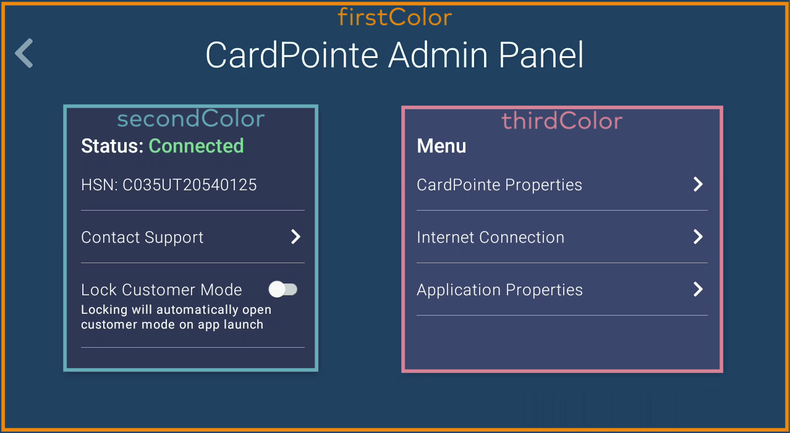
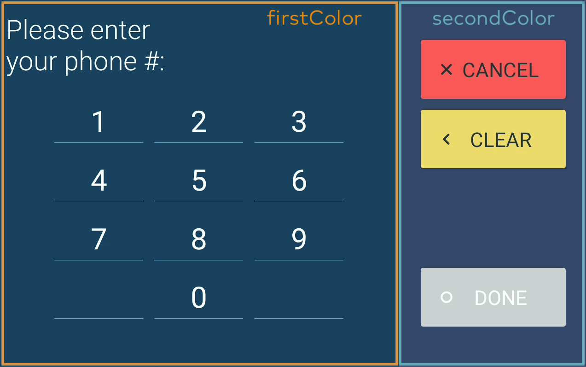
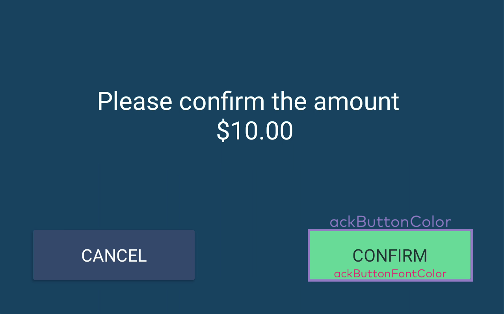
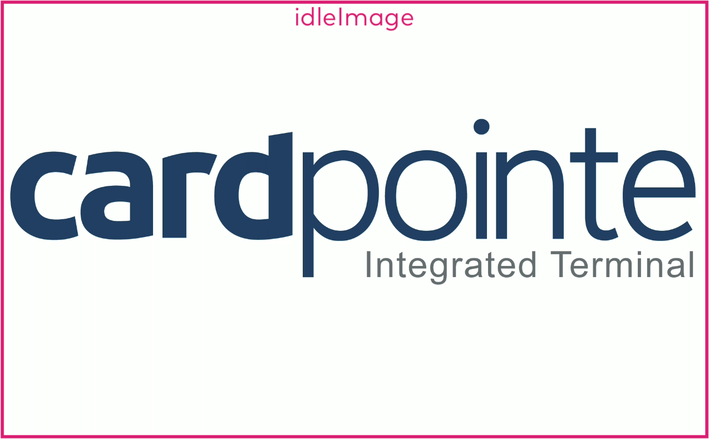

# Overview

The CardPointe Integrated Terminal solution includes support for Clover Mini and Clover Flex terminals to provide a sleek and secure transaction experience for your customers. By integrating the Terminal API with your POS software, you can quickly build and deploy a complete P2PE payment solution, effectively reducing your scope of PCI compliance as a merchant or integrator.

This solution consists of the following components:

- The Terminal API, which provides your software with access to the terminal service and functions.
- Clover devices, which are EMV pre-certified and enables you to quickly achieve EMV acceptance and PCI scope reduction.
- The CardPointe Gateway, which provides a complete solution for transaction processing and reporting.
- CardSecure, which tokenizes payment card information.
- Clover terminal devices, pre-provisioned and provided for use with your merchant account.
- Your POS software, integrated with the Terminal API.

# What's New? 

## Date Updated: 10/13/2022

Our Bolt family of integrated solutions is now **CardPointe Integrated Payments**.

On Thursday, October 13th, 2022, we released an update to the CardPointe Integrated Terminal Application for Clover terminals. This update includes the following changes:

- If you are using the default device wallpaper and theme, the Bolt wallpaper and logo will be updated to **CardPointe Integrated Terminal**.
- The Bolt App, Admin Menu and other UI elements will be updated to CardPointe.
- The **Bolted** and **Unbolted** statuses will be updated to **Connected** and **Disconnected**, respectively.

Terminals will automatically download and install this update during the nightly reboot window. No merchant action is required. 

For more information on using custom branding for your Clover terminals, see Customizing the Clover Terminal.

## Date Updated: 4/12/2022 

An update to the CardPointe Integrated Terminal application for Clover terminals was released on April 14th, 2022.

This release includes internal enhancements and bug fixes.

<!-- type: row -->

<!-- type: card
title: Clover Terminal Changelog
description: Visit the Changelog for more information on recent updates to the CardPointe Integrated Terminal API and application for Clover terminals.
link:
-->

<!-- type: row-end -->

## Requirements

This solution requires:

- Your merchant account, boarded to the First Data Rapid Connect processing platform.
- Your application, integrated with the Terminal API via HTTPS.
- A Clover terminal device, pre-provisioned and provided for use with your merchant account.

For more Information on specific requirements contact isvintegrations@fiserv.com.

## Additional Resources

### Sample Postman Collection

To help you get started with your integration, we've created a sample Postman Collection that includes a template of the Terminal API service endpoints and parameters that are supported for Clover terminals. Click the following button to download the sample collection:

[Run in Postman](https://app.getpostman.com/run-collection/16c349c3713011b8c18c?action=collection%2Fimport#?env%5BBolt%20Terminal%20API%20UAT%20Environment%5D=W3sia2V5Ijoic2l0ZSIsInZhbHVlIjoie1VBVCBvciBwcm9kdWN0aW9uIHNpdGV9IiwiZW5hYmxlZCI6dHJ1ZX0seyJrZXkiOiJ1cmwiLCJ2YWx1ZSI6Imh0dHBzOi8ve3tzaXRlfX0uY2FyZHBvaW50ZS5jb20vYXBpIiwiZW5hYmxlZCI6dHJ1ZX0seyJrZXkiOiJBdXRob3JpemF0aW9uIiwidmFsdWUiOiJ7eW91ciBhdXRoIGtleX0iLCJlbmFibGVkIjp0cnVlfSx7ImtleSI6Im1lcmNoYW50SWQiLCJ2YWx1ZSI6Int5b3VyIG1lcmNoYW50SWR9IiwiZW5hYmxlZCI6dHJ1ZX0seyJrZXkiOiJoc24iLCJ2YWx1ZSI6Int5b3VyIGhzbn0iLCJlbmFibGVkIjp0cnVlfSx7ImtleSI6IlgtQ2FyZENvbm5lY3QtU2Vzc2lvbktleSIsInZhbHVlIjoiIiwiZW5hYmxlZCI6dHJ1ZX1d)

See Configuring Your Postman Environment in the general CardPointe Integrated Terminal Developer Guides for detailed information on setting up your environment variables.

### Related Documentation

This guide provides useful information specific to integrating Clover terminals. The following API references and terminal user guides provide additional helpful information: 

- See the Terminal API documentation for detailed information for integrating the Terminal API with your software.
- See the CardPointe Integrated Terminal Developer Guides for additional helpful information for developing various Terminal API workflows.
- See the CardPointe Gateway API documentation for detailed information for integrating the full capabilities of the CardPointe Gateway.
- See the Terminal User Guides for detailed information on setting up and using your Clover device.

# Integrating a Clover Terminal

If your payment acceptance solution already uses the Terminal API to integrate Ingenico terminals, you can add support for Clover terminals with some minor adjustments to your integration.

## Device Integration Details

Clover terminals offer a few additional features when compared to the Ingenico terminals. The following topics describe the new and different features that you should consider. 

### Terminal Activation Codes

When your merchants unbox a new Clover terminal device, they must enter an activation code during the initial setup process. This activation code is provided in a welcome email; however you may want to retrieve and display the activation code within your application, to improve the setup process for your merchants.

The Terminal API includes a `terminalActivationCode` endpoint, which you can use to supply the merchant ID and hardware serial number (HSN) associated with a specific terminal to retrieve the activation code for that terminal. 

The following example illustrates the `terminalActivationCode` request and response:

#### Sample terminalActivationCode Request and Response

```json
Request: 

POST /api/v3/terminalActivationCode HTTP/1.1
Host: uat.cardpointe.com:
Content-Type: application/json
X-CardConnect-SessionKey: b7964afcb63d4dbe9761667fb46e9644
Authorization: <Terminal API Key>

{
    "merchantId": "496414613885",
    "hsn": "C032UQ82940114"
}

Response:

{    
     "terminalActivationCode": "00115211"
}
```

### Merchant and Customer Modes

The CardPointe Integrated Terminal app for Clover terminals has two modes of operation: _Merchant_ Mode and _Customer_ Mode.

_Customer Mode_ is the customer-facing interface, in which the device displays an idle screen until your application sends a command to the device. This is the default mode of operation, and the device should remain in Customer Mode.

<!-- theme: danger -->
> The terminal can only receive commands when the terminal is connected and running in Customer Mode. 
>
> With the exception of the ping request, the terminal ignores commands from your software when it is in Merchant Mode. If you send a ping request while the device is in merchant mode, a "Ping received" message is displayed on the device.
>
> Other Terminal API requests that send commands to the device return the error
> `"errorMessage": "hsn: <hsn> is currently in merchant mode".`

_Merchant_ Mode is the merchant-facing administrative interface. In Merchant Mode, the merchant user can access the Admin Panel to configure and troubleshoot the application and device settings. Additionally, the user can exit the app to access the App Launcher and Settings menu to access the Android device settings. The merchant user can switch from Customer Mode to Merchant Mode by pressing all four corners of the touch screen simultaneously.

A noted, only the ping request should be used when the device is in Merchant Mode. 

### Receipt Printing

The Clover terminal includes a built-in receipt printer. To take advantage of this feature, the authCard and authManual Terminal API service endpoints now include a printReceipt parameter. See Software Integration Details for more information on integrating this feature with your software.

When a transaction is successfully authorized by the CardPointe Gateway, the authorization response includes EMV card data (if the payment was made using an EMV or contactless payment) as well as specific merchant information. Some receipt field settings must be configured for your merchant account. 

See Printing Receipts later in this guide for detailed information on the data used to print a receipt from the Clover terminal, and for guidelines on integrating a custom solution for receipt printing. Additionally, you can customize the data that you include on your receipts, depending on your business needs.

<!-- theme: danger -->
> For Clover Mini terminals, the printer is disabled when the device enters low-power mode. The Clover Mini must be connected to the hub, and the hub must be connected to a power source in order to print receipts.
>
> If your application sends a request to the printer while the terminal is in low-power mode, the response includes the following error fields:
> 
> `"errorCode": 800,`
> `"errorMessage": "Printing not supported"`

### Display Specifications

The Clover Mini features a 7″ 1280×800 touch screen display, in a landscape orientation. 

The Clover Flex features a 5" 720×1280 touch screen display in a portrait orientation. 

### LTE Connectivity

The Clover terminals support LTE connectivity, which enables merchants to fall back on the LTE wireless network to continue to process transactions in the event of a network interruption. Note that the device must have an active SIM card and wireless data plan, and merchants can manage these settings on the device.

When the terminal switches from the Wi-Fi/Ethernet network to the LTE network, the device loses the connection to the terminal service, and a new session must be established by calling the Terminal API `connect` endpoint. When you call the `connect` endpoint to establish a new connection, you can optionally include the `force` parameter with a value of `true` to terminate the existing session (and any in-flight operations) before establishing the new session.

LTE connection quality and speed can vary, and may be slower than the device's primary Ethernet or Wi-Fi connection. Therefore, your software should allow for a delay in communications with the terminal.

## Software Integration Details

The following topics describe some specific details for integrating Clover terminals and key differences from the Terminal API integration for Ingenico terminals.

> See the Terminal API Documentation for detailed information on integrating the Terminal API with your software.

### Supported Endpoints

The following table illustrates which Terminal API endpoints are supported for use with Clover terminals. See Key Differences for detailed information on updating your integration.

| Resource Name | Ingenico | Clover |
| --- | --- | --- |
| authCard | &#10003; | &#10003; (with key differences) |
| authManual | &#10003; | &#10003; (with key differences) |
| printReceipt |  | &#10003; |
| cancel | &#10003; | &#10003; |
| clearDisplay | &#10003; | &#10003; |
| connect | &#10003; | &#10003; |
| dateTime | &#10003; | &#10003; |
| disconnect | &#10003; | &#10003; |
| display | &#10003; | &#10003; (with key differences) |
| listTerminals | &#10003; | &#10003; |
| ping | &#10003; | &#10003; |
| preconnect | &#10003; |  | 
| readConfirmation | &#10003; | &#10003; |
| readInput | &#10003; | &#10003; |
| readSignature | &#10003; | &#10003; |
| readCard | &#10003; | &#10003; (with key differences) | 
| readManual | &#10003; |  | 
| tip | &#10003; | &#10003; |
| terminalDetails | &#10003; | &#10003; |

### Key Differences

The following table explains the minor changes to the Terminal API, and how you should adjust your software integration to support the Clover terminals.

| Terminal API Service Endpoint | Parameter | Comments | 
| --- | --- | --- |
| preconnect |  | Two-factor authentication is not currently supported for  Clover terminals; therefore, the `preconnect` service endpoint is not used to generate a token. If your application passes a value of `true` for this parameter, it will be ignored by the terminal. <br> <br> Call the `connect` service endpoint to establish a session. |
| display |  | On a Clover terminal, sending either a single or multi-line message replaces the idle image with the message, along with the logo image (if one is configured for the device). <br> <br> On Ingenico terminals, sending a single-line message displays the message in the display footer, retaining the idle image; whereas, sending a multi-line string displays the text in the primary display area, replacing the idle image. |
| readManual |  | The `readManual` service endpoint is not supported for Clover terminals. This means that you can not use the terminal to retrieve a token for use by your POS software. <br> <br> If you previously used the `readManual` service endpoint to capture and tokenize manually-entered card data to use in a subsequent authorization request from your POS software via the CardPointe Gateway API, you can instead use the `authManual` endpoint to streamline those individual requests into a single call. |
| authCard | **The following parameters are not supported:** |
|  | aid | Currently, the Clover terminal processes all transactions as credit; therefore, the `aid` parameter used to specify the transaction type is superseded. <br> <br> Support for debit transactions is planned for a future update. |
|  | includeAmountDisplay | The `includeAmountDisplay` parameter is not supported. The device displays the payment amount to the user regardless of this parameter's value within the `authCard` request. |
|  | **The following parameters are specific to Clover terminals:** |
|  | printReceipt | The `printReceipt` parameter is used to specify whether or not to print a receipt from the Clover terminal. <br> <br> Set to `true` to enable receipt printing. Defaults to `false` if not specified. <br> <br> For the Clover Mini, the built-in printer is disabled when the terminal is in low-power mode. The terminal must be connected to the hub, and the hub must be connected to a power source in order to print receipts. <br> <br> If the `authCard` or `authManual` request includes `"printReceipt" : "true"` but the terminal is in low-power mode, the response includes the following error fields: <br> `"errorCode": 800,` <br> `"errorMessage": "Printing not supported"` <br> <br> See Printing Receipts for detailed information. |
|  | printExtraReceipt | the `printExtraReceipt` parameter is used to specify whether or not to print a second copy of the receipt. Use the `printDelay` parameter to specify the amount of time (in milliseconds) to wait between printing each receipt. <br> <br> Defaults to **false** if not specified. <br> <br> **Note**: If true, the `printDelay` parameter is also **required** in the request, to specify the delay (in milliseconds) between printing the first and second receipts. |
|  | printDelay | 	Required when `"printExtraReceipt":"true"`. The number of milliseconds to wait after printing the first receipt, to begin printing the second receipt. <br> <br> Valid values range from `0` to `60000`. |
| authManual | **The following parameters are not supported:** | 
|  | aid | Currently, the Clover terminal processes all transactions as credit; therefore, the `aid` parameter used to specify the transaction type is superseded. <br> <br> Support for debit transactions is planned for a future update. |
|  | includeAmountDisplay | The `includeAmountDisplay` parameter is not supported. The device displays the payment amount to the user regardless of this parameter's value within the `authManual` request. |
|  | includeAVS | The `includeAVS` parameter must be set to `false` or not included in the request. <br> <br> If a request includes `"includeAVS" : "true"` the `authManual` command sequence fails to complete, and an error is returned in the response data. |
|  | includeCVV | The `includeCVV` parameter must be set to `false` or not included in the request. <br> <br> If a request includes `"includeCVV" : "true"` the `authManual` command sequence fails to complete, and an error is returned in the response data. |
|  | **The following parameters are specific to Clover terminals:** |
|  | printReceipt | The `printReceipt` parameter is used to specify whether or not to print a receipt from the Clover Mini. <br> <br> Set to `true` to enable receipt printing. Defaults to `false` if not specified. <br> <br> Note that the built-in printer is disabled when the device is in low-power mode. The device must be connected to the hub, and the hub must be connected to a power source in order to print receipts. <br> <br> If the `authCard` or `authManual` request includes `"printReceipt" : "true"` but the device is in low-power mode, the response includes the following error fields: <br> <br> `"errorCode": 800,` <br> `"errorMessage": "Printing not supported"` <br> <br> See Printing Receipts for detailed information. |
|  | printExtraReceipt | the `printExtraReceipt` parameter is used to specify whether or not to print a second copy of the receipt. Use the `printDelay` parameter to specify the amount of time (in milliseconds) to wait between printing each receipt. <br> <br> Defaults to **false** if not specified. <br> <br> **Note**: If true, the `printDelay` parameter is also **required** in the request, to specify the delay (in milliseconds) between printing the first and second receipts. |
|  | printDelay | Required when `"printExtraReceipt":"true"`. The number of milliseconds to wait after printing the first receipt, to begin printing the second receipt. <br> <br> Valid values range from `0` to `60000`. |
| readCard | **The following parameters are not supported:** |
|  | aid | Currently, the Clover terminal processes all transactions as credit; therefore, the `aid` parameter used to specify the transaction type is superseded. <br> <br> Support for debit transactions is planned for a future update. |

# Customizing the Clover Terminal

The Clover terminal app supports custom color and image settings to match your business' branding.

| Property Name	| Value Type | Default Setting	| Description |
| --- | --- | --- | --- |
| firstColor | hex | `46597f` | Specifies the primary color displayed in the background. |
| secondColor | hex	| `2b3855` | Specifies the secondary color used throughout the application. |
| thirdColor | hex | `37476c` | Specifies the tertiary color used throughout the application.
| fontColor	| hex | `ffffff` | Specifies the system-wide font color.
| ackButtonColor | hex | `6ada99` | Specifies the color of the acknowledge button. <br> <br> This button is displayed when the merchant or customer is prompted to acknowledge a message on the terminal (for example, to confirm an amount).
| ackButtonFontColor | hex | 000000	| Specifies the font color used on the acknowledge button.
| idleimage | JPEG or PNG image file | CardPointe app wallpaper	| Specifies the image displayed when the device is idle. <br> <br> The image must meet the following requirements: <br> <br> The dimensions must be: <br> - **Mini** - 1280x800 <br> - **Flex** - 720x1280 <br> The file type must be PNG or JPEG. <br> The file size must not exceed 1MB <br> <br> By default, the CardPointe Integrated Terminal wallpaper is displayed.
| logoimage | JPEG or PNG image file | CardPointe  logo	| Specifies the logo image that appears on the Welcome screen and other displays. <br> <br> The image **must** meet the following requirements: <br> - The dimensions must be 267x67. <br> - The file type must be PNG or JPEG. <br> - The file size must not exceed 1MB <br> <br> By default, the CardPointe Integrated Terminal logo is displayed. 

Expand the following examples to see how the style properties correspond to the app UI elements:

> The examples illustrate the Clover Mini display; however, the elements are the same for both devices.

<!--
type: tab
titles: Custom Color Properties, Custom Image Properties
-->







<!--
type: tab
-->




<!-- type: tab-end -->

# Printing Receipts

This topic provides information for printing receipts, either from the Clover terminal's built-in printer, or using your own custom integration. 

## Receipt Rules and Requirements

Consult the following card brand guidelines for detailed information:

- **MasterCard**: https://www.mastercard.us/content/dam/mccom/global/documents/transaction-processing-rules.pdf
- **Visa**: https://usa.visa.com/dam/VCOM/download/about-visa/visa-rules-public.pdf

Additionally, receipt requirements vary depending on the card type. For example, receipts generated for EMV (chip and contactless) card transactions must include specific EMV tag data returned in the authorization response. Ensure that you understand the requirements for accepting both EMV and MSR (magnetic-stripe) cards as determined by the card brands.

## Understanding Receipt Data

When an authorization is successfully approved and processed by the CardPointe Gateway, the authorization response payload includes important transaction details that you can capture and print on a receipt.

In general, a receipt must include:

- transaction details from the authorization response
- merchant account information and additional transaction details returned in the receipt object
- EMV tag data returned in the EMV tag object, if the card used was an EMV (chip or contactless) card.

### Authorization Response Data

A successful authorization response includes the following fields. If you are integrating the Clover terminal's built-in printer, the highlighted fields are included in on the receipt. Otherwise, it is recommended that you include these fields on a receipt generated from your custom integration.

| Field | Content | Max Length | Comments |
| --- | --- | --- | --- |
| respstat | Status | 1 | Indicates the status of the authorization request. Can be one of the following values: <br> <br> A - Approved <br> B - Retry <br> C - Declined |
| retref | Retrieval reference number | 12 | CardPointe retrieval reference number from authorization response |
| account | Account number | 19 | Copied from the authorization request, masked except for the last four digits. |
| token (if requested) | Token | 19 | A token that replaces the card number in capture and settlement requests if requested |
| amount | Amount | 12 | Authorized amount. Same as the request amount for most approvals. <br> The amount remaining on the card for prepaid/gift cards if partial authorization is enabled. <br> Not relevant for declines. |
| batchid | Batch ID | 12 | Automatically created and assigned unless otherwise specified. Returned for a successful authorization with capture. |
| orderid | Order ID | 19 | Order ID copied from the authorization request. |
| merchid | Merchant ID | 12 | Copied from the authorization request. <br> **Note**: _If you include the merchant ID on a receipt, mask this value, except the last four digits_. |
| respcode | Response code | - | Alpha-numeric response code that represents the description of the response |
| resptext | Response text | - | Text description of response |
| respproc | Response processor | 4 | Abbreviation that represents the platform and the processor for the transaction |
| bintype | Type of BIN | 16 | **Possible Values**: <br> <br> Corp <br> FSA+Prepaid <br> GSA+Purchase <br> Prepaid <br> Prepaid+Corp <br> Prepaid+Purchase <br> Purchase |
| entrymode | POS Entry Mode | 25 | Only returned for merchants using the First Data North and RapidConnect front end platforms. <br> **Possible Values**: <br> <br> Keyed <br> Moto <br> ECommerce <br> Recurring <br> Swipe(Non EMV) <br> DigitalWallet <br> EMVContact <br> Contactless <br> Fallback to Swipe <br> Fallback to Keyed |
| avsresp | AVS response code | 2 | Alpha-numeric AVS response. |
| cvvresp | CVV response code | 1 | Alpha-numeric CVV response. |
| authcode | Authorization code | 6 | Authorization Code from the Issuer |
| signature | Signature Bitmap | 6144 | JSON escaped, Base64 encoded, Gzipped, BMP file representing the cardholder's signature. Returned if the authorization used a token that had associated signature data or track data with embedded signature data. <br> <br> If you are integrating a custom receipt solution, you can convert this image file and print it to the receipt, if required. |
| commcard | Commercial card flag | 1 | **Y** if a Corporate or Purchase Card |
| emv | Cryptogram | - | Authorization Response Cryptogram (ARPC). This is returned only when EMV data is present within the Track Parameter. |
| emvTagData | EMV tag data | 2000 | A string of receipt and EMV tag data (when applicable) returned from the processor. <br> <br> This data returned should be presented on a receipt if applicable, and recorded with the transaction details for future reference. <br> <br> Refer to EMV Tag Data below for a list of the possible fields returned. |
| receipt | receipt data | - | An object that includes additional fields to be printed on a receipt. <br> <br> Refer to Receipt Data below for a list of the fields returned. |

### EMV Tag Data

If the card used in the authorization request was an EMV (chip or contactless) card, then the response data includes an **emvTagData** object with the following fields:

| Name | Tag | Details | Source | Format | Max Length |
| --- | --- | --- | --- | --- | --- |
| TVR (Terminal Verification Results) | 95 | Status of the different functions as seen from the terminal | Terminal | Binary | 5 |
| ARC (Authorization Response Code) | 8A | Indicates the transaction disposition of the transaction received from the issuer for online authorizations.	| Issuer/Terminal | String | 2 |
| PIN (CVM Results) | 9F34 | Indicates the results of the last CVM performed. If PIN was entered, returns "Verified by PIN"	| Terminal | String | 15 |
| Signature (CVM Results) | 9F34 | Indicates the results of the last CVM performed. If "true" then CVM supports signature and signature line may be applicable. However, card brands have moved away from requiring signature for EMV transactions. | Terminal | Boolean | 5 |
| Mode | - | Identifies the mode used to authorize (or decline) the transaction. Always "Issuer" | CardPointe Gateway | String | 6 | 
| TSI (Transaction Status Information) | 9B | Indicates the functions performed in a transaction | Terminal | Binary | 2 |
| Application Preferred Name | 9F12 | Preferred mnemonic associated with the AID. If unavailable, use Application Label. | Card | String | 16 |
| AID (Application Identifier, Terminal) | 9F06 | Identifies the application as described in ISO/IEC 7816-5	| Terminal | Binary | 16 |
| IAD (Issuer Application Data) | 9F10 | Contains proprietary application data for transmission to the issuer in an online transaction.	| Card | Binary | 32 |
| Entry method | - | Indicator identifying how the card information was obtained.	| Terminal | String | 26 |
| Application Label | 50 | Mnemonic associated with the AID according to ISO/IEC 7816-5. If unavailable, use the Application Preferred Name. | Card | String (with the special character limited to space) | 16 | 

### Receipt Data

The receipt object, included in the authorization response, provides merchant account information. The merchant account information is populated using the merchant properties configured for the MID.

You can specify the following fields in a `userFields` object to to override the merchant properties:

| Field | Description |
| --- | --- |
| receiptHeader	| Use this field to override the header configured for your MID. |
| receiptFooter	| Use this field to override the footer configured for your MID. |
| receiptDba	| Use this field to override the DBA name configured for your MID. |
| receiptPhone	| Use this field to override the phone number configured for your MID. |
| receiptAddress1 |	Use this field to override the address (line 1) configured for your MID. |
| receiptAddress2	| Use this field to override the address (line 1) configured for your MID. |

Each value can be any string and the total length of user defined fields (URL/JSON-encoded) is limited to 4000 bytes. See the userFields description in the CardPointe Gateway API documentation for more information.

A successful authorization response includes a receipt object with the following fields:

| Field | Format | Description |
| --- | --- | --- |
| header | AN |	A customizable field to display an alphanumeric message. For example, a specific terms, disclosure, or cardholder agreement statement. |
| footer | AN | A customizable field to display an alphanumeric message. For example, a specific terms, disclosure, or cardholder agreement statement. |
| dba |	AN | The merchant's Doing Business As (DBA) name. |
| address1 | AN |	Line 1 of the merchant's address. |
| address2 | AN |	Line 2 of the merchant's address. |
| phone |	N	| The merchant's phone number. |
| dateTime | N | The date and time of the transaction (YYYYMMDDHHMMSS). |
| nameOnCard | A | The Cardholder's name, if included in the authorization request. |

## Printing a Receipt

You can print a receipt in one of two ways:

- Directly from the Clover terminal's built-in printer, using the Terminal API.
- From your POS system's custom printer integration.

<!-- theme: danger -->
> For the Clover Mini, the built-in printer is disabled when the terminal is in low-power mode. The terminal must be connected to the hub, and the hub must be connected to a power source in order to print receipts.
>
> If your application sends a request to the printer while the terminal is in low-power mode, the response includes the following error fields:
>
> `"errorCode": 800,`
> `"errorMessage": "Printing not supported"`

### Printing a Receipt Using the authCard or authManual Request 

To print a receipt at the time of the transaction, include the `"printReceipt" : "true"` parameter in your authCard or authManual request. 

To print a second copy of the receipt at the time of the transaction, include `"printExtraReceipt":"true"` and specify a `printDelay` value between `0` and `60000` milliseconds (for example `"printDelay":"1000"`)

### Reprinting a Receipt Using the printReceipt Request 

To reprint a receipt for a past transaction, make a request to the printReceipt endpoint, including the `orderId` associated with the existing transaction. Note that if more than one transaction is associated with the order ID, the most recent transaction is selected.

### Printing a Receipt from a Standalone Printer 

To print a receipt from your custom integration, use the fields described in Understanding Receipt Data to build your receipt template.

In the following example, the Clover terminal receipt template is illustrated on the left, including the fields that are populated from the authorization response data. A sample receipt is illustrated on the right.


