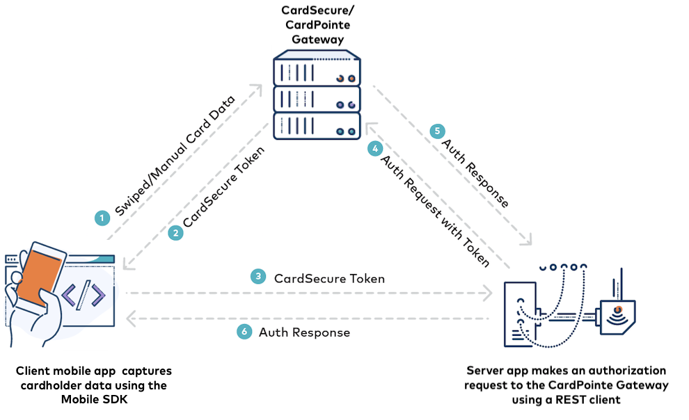

# Introduction

The CardPointe Mobile SDKs seamlessly connect your mobile applications to CardSecure to securely encrypt and tokenize customers' payment card data. Tokens and associated payment details can then be retrieved by your server application and securely transmitted to the CardPointe Gateway for authorization.

CardPointe Mobile SDKs are available for Androidtm and iOS apps, as well as server-side tool kits to help you get started with your server application.

This guide provides an overview of the Mobile SDKs. See the CardPointe Mobile SDK Developer Guides for detailed information on integrating payments with your mobile app.

# Overview

A complete mobile payment integration consists of two components:

- Tokenization is handled by the CardPointe Mobile SDK (Android or iOS) integrated with your mobile application.
- Authorization is handled by host scripts integrated with your server application.

## Tokenization (Client-side)

The CardPointe Mobile SDK installs alongside your mobile application, and uses CardSecure to tokenize and encrypt payment card data. Card data can be manually entered in the application or captured, using a supported mobile payment reader device. Payment card data is encrypted and tokenized without being exposed to your software application or server.

Additionally, tokens can be stored in customer profiles for use in subsequent transactions.

See Understanding CardSecure Tokens for detailed information on how CardSecure tokens are created and used.

## Authorization (Server-side)

The CardPointe Gateway REST clients install on your application server to integrate your solution to the CardPointe Gateway.

Using a REST client, your sever authenticates with the CardPointe Gateway, makes authorization requests using tokens retrieved from the mobile app, and handles responses from the Gateway.

See Server-side Host Scripts for information on using the CardPointe Gateway REST clients.

See the CardPointe Gateway API documentation for more information on the features and capabilities of the CardPointe Gateway.

## Tokenization and Authorization Flow

The following diagram illustrates the tokenization and payment flow using the Mobile SDK and server-side REST client.

<!-- align: center -->

1) Your mobile app collects payment card data from a connected mobile payment reader or by manual entry in the app and sends the data to CardSecure via the CardPointe Mobile SDK.
2) CardSecure returns a token to the mobile app.
3) The mobile app sends the token to your server, which is running a CardPointe Gateway REST client.
4) Your server application uses the token to make an authorization request to the CardPointe Gateway, via the REST client.
5) The CardPointe Gateway returns the authorization response to your server.
6) Your server passes the authorization response to the mobile app.

## PCI Compliance

Using the CardPointe Mobile SDK to integrate secure payments with your mobile application can help reduce your PCI scope. The SDK provides direct tokenization methods that pass your customers' sensitive card data to CardSecure without ever sending the clear or unencrypted card data to your server.

The token returned from this process is not considered card data; therefore, as the token moves between your client application and your application server, the token does not bring any of those systems or data paths into scope for PCI security controls.

## Supported Devices

If you are developing an application to accept card-present payments, you must integrate a mobile payment reader (swiper) device with your solution. Currently, the CardPointe Mobile SDKs include support for the ID TECH VP3300.

The VP3300 is a Bluetooth-enabled mobile payment reader device that supports MSR (swipe) and EMV (chip) transactions. The VP3300 connects to your phone or tablet using Bluetooth 4.0, which supports Bluetooth Low Energy (BLE) and automatic pairing.

For more information on using the VP3300, see the CardPointe Mobile Device User's Guide.

<!-- theme: danger -->
> The ID TECH VP3300 is only available for merchants processing on the First Data Rapid Connect platform.

# CardPointe Mobile SDKs

For detailed information on the CardPointe Mobile SDKs, see the Android and iOS SDK Developer Guides:

<!-- type: row -->

<!-- type: card 
title: CardPointe Mobile iOS SDK Developer Guide
description: Provides information for integrating the CardPointe Mobile SDK with your iOS app
link:
-->

<!-- type: card
title: CardPointe Mobile Android SDK Developer Guide
description: Provides information for integrating the CardPointe Mobile SDK with your Android app
link:
-->

<!-- type: row-end -->

# Server-Side Host Scripts

As described in the [CardPointe Mobile SDK Overview](?path=../../../../docs/documentation/CardPointeMobileSDKs.md), your server-side application must retrieve the token from your mobile application to then use in an authorization request to the CardPointe Gateway to complete a payment. The following topics provide sample server-side scripts that you can use to integrate the necessary CardPointe Gateway API requests with your application.

Sample scripts are currently available in the following languages:

- Python
- Node.js
These sample scripts provide the following CardPointe Gateway API request methods:

- Authorization
- Capture
- Void
- Refund
- Funding
- Profile
- Signature Capture

<!-- theme: warning -->
> These sample scripts are intended to serve as example implementations, and do not represent the current and full capabilities of the CardPointe Gateway API. 
> See the CardPointe Gateway API for detailed, up-to-date information on using these request methods and handling response data.

## Python Toolkit

<!-- type: row -->

<!-- type: card
title: Python Server-Side Toolkit ZIP
link: ?path=assets/images/CardConnect-SDK-Toolkit.zip
-->

<!-- type: row-end -->

### Files in the CardConnectSDK Root Directory

The CardConnectSDK root directory includes the following files:

- setup.py – Generates the Python build products. Used for distribution to places like PyPI.
- tox.ini – Configures the tests in the SDK for execution inside a container via Tox automation.

### Files in the /cardconnect Subdirectory

The /cardconnect subdirectory includes the following files:

- api_requestor.py – Provides classes for making requests using the CardPointe Gateway API.
- error.py – Provides classes for handling error responses from the SDK:
  - ApiAuthenticationError
  - ApiConnectionError
  - ApiError
  - ApiRequestError
- http_client.py – Provides classes for HTTP communication required by the CardPointe Gateway API. 
- init.py – Imports all components of the SDK.
- service.py – Provides classes for Auth, Capture, Void, Refund, Funding, Profile, and SigCap requests, the core object types in the SDK.
- util.py – Provides utility classes for logging, imports, and formatting.

### Files in the /cardconnect/test Subdirectory

The /examples subdirectory includes the following working sample scripts:

- auth.py
- capture.py
- funding.py
- profile.py
- refund.py
- sigcap.py
- void.py

## Node.js Toolkit

<!-- type: row -->

<!-- type: card
title: Node Server-Side Toolkit ZIP
link: ?path=assets/images/Node-Server-Side-Toolkit.zip
-->

<!-- type: row-end -->

### Files in the CardConnectSDK Root Directory

The CardConnectSDK root directory includes the following files:

- package.json – Sets the default test runner and dependencies that will be installed when you run NPM install.
- gulpfile.js - Sets up the test functions and linters.

### Files in the /cardconnect Subdirectory

The /cardconnect subdirectory includes the following files:

- cardconnect.js – Provides definitions for Auth, Capture, Void, Refund, Funding, Profile, and SigCap requests, the core object types in the SDK.
- api_requestor.js – Provides an abstract class used by the SDK to send HTTP requests using the CardPointe Gateway API.

### Files in the /cardconnect/test Subdirectory

The /cardconnect/test subdirectory includes the following unit test files:

- test_auth.js
- test_capture.js
- test_funding.js
- test_profile.js
- test_refund.js
- test_sigcap.js
- test_void.js

### Files in the /examples Subdirectory

The /examples subdirectory includes the following working sample scripts:

- auth.js
- capture.js
- funding.js
- profile.js
- refund.js
- sigcap.js
- void.js
