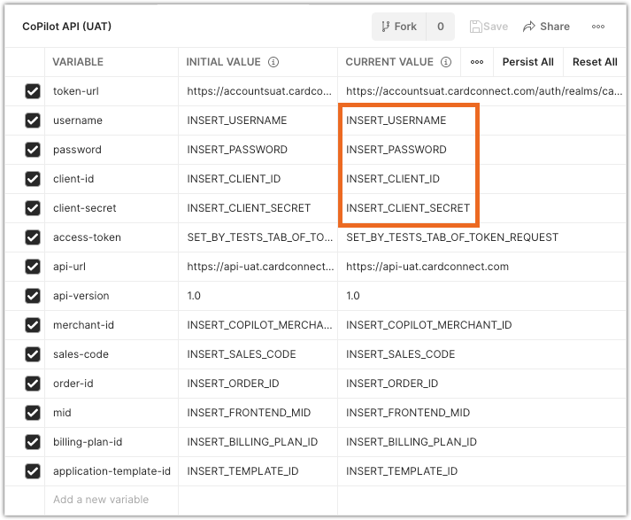

<!-- type: row -->

<!-- type: card
description: The following guide provides best practices and other supplemental information for integrating the CoPilot API.

-->

<!-- type: row-end -->

# Using the CoPilot API to Submit a Merchant Application 

## Overview 

The Copilot API is an interface into the CoPilot merchant management platform. You can use the CoPilot API to create and update merchant accounts programmatically, instead of using the CoPilot web interface. 

> Applications generated using the CoPilot API cannot be white-labeled. The merchant application contains CardPointe and CardConnect branding as an indicator that the merchant account is independent of the ISV partner’s software, as well as containing CardConnect's Terms and Conditions that must be reviewed and accepted in order to create the account.

### Merchant Creation Workflow 

The following process outlines the typical workflow for using the CoPilot API to create a merchant account and send the digital application to the owner for review and signing:

1) Submit a request to the Token endpoint to obtain a bearer token needed for authentication.
2) Submit a `POST` request to the Merchant endpoint to create a new merchant account.
3) Store the CoPilot Merchant ID returned in the response, as it is needed in subsequent calls.
4) Submit a `PUT` request to the Signature endpoint to receive the link to the digital application.

Provide the digital application URL to the merchant so that they may review and sign the application digitally using their web browser. Once signed, the account then automatically progresses through the remaining underwriting and boarding procedures.

### Running the API in Postman 

To help you get started with your integration, we have created a Postman Collection that includes templates for all of the requests documented in the CoPilot API. 

The Postman Collection also includes a sample Environment containing variables for fields that are required in many of the API requests. See Configuring Your Postman Environment below for more information. 

Click the button below to download the CoPilot API Postman collection:

[Run in Postman](https://app.getpostman.com/run-collection/123cd242a1b83c941022?action=collection%2Fimport#?env%5BCoPilot%20API%20(UAT)%5D=W3sia2V5IjoidG9rZW4tdXJsIiwidmFsdWUiOiJodHRwczovL2FjY291bnRzdWF0LmNhcmRjb25uZWN0LmNvbS9hdXRoL3JlYWxtcy9jYXJkY29ubmVjdC9wcm90b2NvbC9vcGVuaWQtY29ubmVjdC90b2tlbiIsImVuYWJsZWQiOnRydWV9LHsia2V5IjoidXNlcm5hbWUiLCJ2YWx1ZSI6IklOU0VSVF9VU0VSTkFNRSIsImVuYWJsZWQiOnRydWV9LHsia2V5IjoicGFzc3dvcmQiLCJ2YWx1ZSI6IklOU0VSVF9QQVNTV09SRCIsImVuYWJsZWQiOnRydWV9LHsia2V5IjoiY2xpZW50LWlkIiwidmFsdWUiOiJJTlNFUlRfQ0xJRU5UX0lEIiwiZW5hYmxlZCI6dHJ1ZX0seyJrZXkiOiJjbGllbnQtc2VjcmV0IiwidmFsdWUiOiJJTlNFUlRfQ0xJRU5UX1NFQ1JFVCIsImVuYWJsZWQiOnRydWV9LHsia2V5IjoiYWNjZXNzLXRva2VuIiwidmFsdWUiOiJTRVRfQllfVEVTVFNfVEFCX09GX1RPS0VOX1JFUVVFU1QiLCJlbmFibGVkIjp0cnVlfSx7ImtleSI6ImFwaS11cmwiLCJ2YWx1ZSI6Imh0dHBzOi8vYXBpLXVhdC5jYXJkY29ubmVjdC5jb20iLCJlbmFibGVkIjp0cnVlfSx7ImtleSI6ImFwaS12ZXJzaW9uIiwidmFsdWUiOiIxLjAiLCJlbmFibGVkIjp0cnVlfSx7ImtleSI6Im1lcmNoYW50LWlkIiwidmFsdWUiOiJJTlNFUlRfQ09QSUxPVF9NRVJDSEFOVF9JRCIsImVuYWJsZWQiOnRydWV9LHsia2V5Ijoic2FsZXMtY29kZSIsInZhbHVlIjoiSU5TRVJUX1NBTEVTX0NPREUiLCJlbmFibGVkIjp0cnVlfSx7ImtleSI6Im9yZGVyLWlkIiwidmFsdWUiOiJJTlNFUlRfT1JERVJfSUQiLCJlbmFibGVkIjp0cnVlfSx7ImtleSI6Im1pZCIsInZhbHVlIjoiSU5TRVJUX0ZST05URU5EX01JRCIsImVuYWJsZWQiOnRydWV9LHsia2V5IjoiYmlsbGluZy1wbGFuLWlkIiwidmFsdWUiOiJJTlNFUlRfQklMTElOR19QTEFOX0lEIiwiZW5hYmxlZCI6dHJ1ZX0seyJrZXkiOiJhcHBsaWNhdGlvbi10ZW1wbGF0ZS1pZCIsInZhbHVlIjoiSU5TRVJUX1RFTVBMQVRFX0lEIiwiZW5hYmxlZCI6dHJ1ZX1d)

### Configuring Your Postman Environment 

Included with the collection is a Postman Environment containing variables where you can pre-fill fields that are required in many of the API requests. 

As an initial step in configuring your environment variables, enter your authentication credentials in the existing environment variables and send a request to the Token endpoint. The Bearer token returned is automatically stored to the `access-token` environment variable and used to authenticate your subsequent API requests.

<!-- align: center -->


<!-- theme: warning -->
> See the [Postman user documentation](https://learning.postman.com/docs/introduction/overview/) for detailed information on using Postman to test APIs.

## Using Application Templates

Before you can create a new merchant account using the CoPilot API, you must first create an Application Template using the CoPilot web interface. Once you have created at least one template in the CoPilot web interface, it is possible to use the CoPilot API exclusively for merchant creation and management in most cases.

The Application Template is required when creating a new account in order to automatically assign pre-configured default values for new accounts. Almost all fields available in the merchant application can be preset using a template, and multiple templates can be created that use different Sales Codes, default pricing, fees, equipment, or other settings.

When creating an account using the API, the Application Template you provide in the request determines what default values are applied to the new account. Remember to supplement the values automatically applied by the Application Template with any additional objects or fields that may also be required in order to request the link to the merchant-facing digital application. See the section on Adding Supplemental Data and Overriding Default Values for more information.

<!-- theme: warning -->
> Although only minimal data is required when creating an Application Template in the CoPilot web interface, you should strongly consider providing as many defaults as possible. This reduces the amount of fields that must be supplied in the API call, ensures standardized values are applied consistently, and can potentially reduce the amount of data the merchant must enter manually.

## Creating an Application

Depending on your needs, you can create applications with varying degrees of merchant data included.

### Creating an Application with Minimal Data 

You might want to provide merchants with an application that requires nearly all fields to be completed by the business owner using the digital application. In this case, you must start by creating an account using the Merchant endpoint with the required business information and contact details.

You can then request the digital application link using the Signature endpoint and supply this URL to the owner to complete and sign the reminder of the digital application using their web browser. Using the digital application link, the owner can add additional owners, input their bank account details, processing volume, select the applicable Merchant Category Code (MCC), and other details needed to submit the application for underwriting and boarding.

The example below illustrates the minimum amount of data needed to create an account and generate the link to the digital signature:

<!--
type: tab
titles: Example: Merchant Create Request with Minimal Data
-->

```json
{
    "templateId": "{{template-id}}",
    "merchant": {
        "salesCode": "{{sales-code}}",
        "dbaName": "The Card Shoppe",
        "legalBusinessName": "The Card Shoppe",
        "taxFilingName": "The Card Shoppe LLC",
        "taxFilingMethod": "EIN",
        "demographic": {
            "businessAddress": {
                "address1": "123 Fake Street",
                "address2": "Suite 300",
                "city": "Keystone",
                "stateCd": "CO",
                "zip": "80435",
                "countryCd": "US"
            },
            "mailingAddress": {
                "address1": "123 Fake Street",
                "address2": "Suite 300",
                "city": "Keystone",
                "stateCd": "CO",
                "zip": "80435",
                "countryCd": "US"
            }
        },
        "ownership": {
            "owner": {
                "ownerAddress": {
                    "address1": "1 Imaginary Lane",
                    "address2": "Apt 221B",
                    "city": "Dillon",
                    "stateCd": "CO",
                    "zip": "80435",
                    "countryCd": "US"
                },
                "ownerEmail": "name@email.com",
                "ownerName": "Forename Surname",
                "ownerPhone": "555-123-4567",
                "ownerTitle": "CEO"
            },
            "driversLicenseNumber": "123456789",
            "driversLicenseStateCd": "CO"
        },
        "bankDetail": {
            "depositBank": {
                "bankAcctNum": "123456789",
                "bankRoutingNum": "987654321",
                "bankAcctTypeCd": "BIZ",
                "bankName": "Deposit Bank"
            },
            "withdrawalBank": {
                "bankAcctNum": "123456789",
                "bankRoutingNum": "987654321",
                "bankAcctTypeCd": "BIZ",
                "bankName": "Withdrawal Bank"
            }
        }
    },
    "ownerSiteUser": {
        "firstName": "Forename",
        "lastName": "Surname",
        "email": "name@email.com"
    }
}
```

<!-- type: tab-end -->

### Creating an Application with Data Gathered from the Merchant 

When you have already gathered business information from the merchant before creating the account in CoPilot, you can supply additional data in the call to the Merchant endpoint to reduce the amount of fields the merchant must manually enter when completing the application. The merchant data you provide during account creation will populate in the digital application that the merchant receives, requiring them to complete only the remaining fields.

The following example illustrates a merchant creation request with additional merchant data included:

<!--
type: tab
titles: Example: Merchant Create Request Using a Template and Merchant Business Details
-->

```json
{
    "templateId":"{{template-id}}",
    "merchant": {
        "salesCode":"{{sales-code}}",
        "dbaName": "The Card Shoppe",
        "legalBusinessName": "The Card Shoppe",
        "taxFilingName": "The Card Shoppe LLC",
        "taxFilingMethod": "EIN",
        "businessStartDate": "09/17/1949",
        "demographic": {
            "websiteAddress": "www.example.com",
            "businessPhone": "555-123-4567",
            "businessAddress": {
                "address1": "123 Fake Street",
                "address2": "Suite 300",
                "city": "Keystone",
                "stateCd": "CO",
                "zip": "80435",
                "countryCd": "US"
            },
            "mailingAddress": {
                "address1": "123 Fake Street",
                "address2": "Suite 300",
                "city": "Keystone",
                "stateCd": "CO",
                "zip": "80435",
                "countryCd": "US",
            }
        },
        "ownership": {
            "owner": {
                "ownerAddress": {
                    "address1": "1 Imaginary Lane",
                    "address2": "Apt 221B",
                    "city": "Dillon",
                    "stateCd": "CO",
                    "zip": "80435",
                    "countryCd": "US",
                },
                "ownerEmail": "name@email.com",
                "ownerName": "Forename Surname",
                "ownerDob": "09/04/1929",
                "ownerPhone": "555-123-4567",
                "ownerMobilePhone": "555-987-6543",
                "ownerSSN": "111-22-3333",
                "ownerTitle": "CEO"
            },
            "ownershipTypeCd": "PRIVCORP",
            "driversLicenseNumber": "123456789",
            "driversLicenseStateCd": "CO",
            "ownerOwnershipPct": "100"
        },
        "merchantContactInfo": {
            "contactName": "Forename Surname",
            "contactEmail": "name@email.com",
            "contactPhone": "555-123-4567"
        },
        "bankDetail": {
            "depositBank": {
                "bankAcctNum": "1234567890",
                "bankRoutingNum": "987654321",
                "bankAcctTypeCd": "BIZ",
                "bankName": "Deposit Bank"
            },
            "withdrawalBank": {
                "bankAcctNum": "1234567890",
                "bankRoutingNum": "091215927",
                "bankAcctTypeCd": "BIZ",
                "bankName": "Withdrawal Bank"
            }
        },
        "processing": {
            "platformDetails": {
                "amexProgramAssetCd": "OPTBLUE",
                "discoverProgramCd": "MAP",
                "acquiringFlg": true,
                "taxId": "123456789",
                "currencyCode": "USD",
                "mccId": "3076",
                "businessDescription": "Business Description"
            },
            "businessDetails": {
                "customerBillPriorToShipFlg": false,
                "depositReqForFulfillFlg": true,
                "whenCustomerChargedCd": "INADVANCE",
                "refundPolicyCd": "EXCHONLY",
                "serviceProvidedInCd": "30LESS"
            },
            "volumeDetails": {
                "averageMonthlyVolume": 9999.00,
                "highTicketAmount": 99.99,
                "averageTicketAmount": 9.99
            },
            "deliveryPercentages": {
                "dlvry0To7DaysPct": 100,
                "dlvry15To30DaysPct": 0,
                "dlvry8To14DaysPct": 0,
                "dlvryOver30DaysPct": 0
            },
            "modeOfTransaction": {
                "eCommercePct": 100,
                "keyedPct": 0,
                "mailOrderPct": 0,
                "swipedPct": 0
            }
        }
    },
    "ownerSiteUser": {
        "firstName": "Forename",
        "lastName": "Surname",
        "email": "name@email.com"
    }
}
```

<!-- type: tab-end -->

### Adding Supplemental Data and Overriding Default Values 

You can set values for fields that are not pre-configured in the Application Template, or override any value set by the Application Template during merchant creation:

- To set or override default values from the Application Template **during** merchant creation, include the values in your **POST** request to the Merchant endpoint.
- To set or override default values from the Application Template **after** the merchant account is created, but prior to generating the digital application link, include the values in a **PUT** request to the Merchant endpoint. Remember to specify the applicable `merchantId` in the endpoint path as outlined in the API documentation.

<!-- theme: danger -->
> You must include all applicable and required fields of the parent object when supplementing or overriding data from the Application Template. For example, if adding or overriding the `earlyCancelFee` in your POST or PUT request, include values for all fields of the `fees` parent object. Any fields omitted under the `fees` parent object will be set to `null`, erasing any previous values set.

## Attaching a Voided Check to an Application

The digital application that the owner receives includes a section to enter and verify their banking information instantly. When a merchant uses the instant verification method to confirm their banking information, you are not required to provide a voided check from the merchant's deposit and withdrawal accounts.

If the merchant bypasses the instant verification and manually enters their banking information, or if you have already obtained voided checks from the merchant, use the Attachment endpoint to upload a copy of the voided checks. Scan the document and convert the file to a Base64-encoded string required for the `document` field in the request.

The following example illustrates a merchant attachment request used to attach a voided check to an application:

<!--
type: tab
titles: Example: Merchant Attachment Request with Voided Check
-->

```json
{
    "attachment" : {
        "fileName" : "VoidedCheck.pdf",
        "mimeType" : "application/pdf",
        "description" : "This is the voided check",
        "attachmentTypeCd" : "VOIDBNKCHK1",
        "document" : "JVBERi0xLjEKJcKlwrHDqwoKMSAwIG9iagogIDw8IC9UeXBlIC9DYXRhbG9nCiAgICAgL1BhZ2Vz
IDIgMCBSCiAgPj4KZW5kb2JqCgoyIDAgb2JqCiAgPDwgL1R5cGUgL1BhZ2VzCiAgICAgL0tpZHMg
WzMgMCBSXQogICAgIC9Db3VudCAxCiAgICAgL01lZGlhQm94IFswIDAgMzAwIDE0NF0KICA+Pgpl
bmRvYmoKCjMgMCBvYmoKICA8PCAgL1R5cGUgL1BhZ2UKICAgICAgL1BhcmVudCAyIDAgUgogICAg
ICAvUmVzb3VyY2VzCiAgICAgICA8PCAvRm9udAogICAgICAgICAgIDw8IC9GMQogICAgICAgICAg
ICAgICA8PCAvVHlwZSAvRm9udAogICAgICAgICAgICAgICAgICAvU3VidHlwZSAvVHlwZTEKICAg
ICAgICAgICAgICAgICAgL0Jhc2VGb250IC9UaW1lcy1Sb21hbgogICAgICAgICAgICAgICA+Pgog
ICAgICAgICAgID4+CiAgICAgICA+PgogICAgICAvQ29udGVudHMgNCAwIFIKICA+PgplbmRvYmoK
CjQgMCBvYmoKICA8PCAvTGVuZ3RoIDU1ID4+CnN0cmVhbQogIEJUCiAgICAvRjEgMTggVGYKICAg
IDAgMCBUZAogICAgKEhlbGxvIFdvcmxkKSBUagogIEVUCmVuZHN0cmVhbQplbmRvYmoKCnhyZWYK
MCA1CjAwMDAwMDAwMDAgNjU1MzUgZiAKMDAwMDAwMDAxOCAwMDAwMCBuIAowMDAwMDAwMDc3IDAw
MDAwIG4gCjAwMDAwMDAxNzggMDAwMDAgbiAKMDAwMDAwMDQ1NyAwMDAwMCBuIAp0cmFpbGVyCiAg
PDwgIC9Sb290IDEgMCBSCiAgICAgIC9TaXplIDUKICA+PgpzdGFydHhyZWYKNTY1CiUlRU9GCg=="
    }
}
```

<!-- type: tab-end -->

## Generating the Digital Application Link

Once you have created the new account and supplied all the required fields, use the Signature endpoint to generate the URL that will be used by the owner to complete and sign the digital application. A successful request returns the digital application URL that can be provided to the account owner.

If the request is unsuccessful, you should refer to the Errors array returned in the response for additional details.

<!-- theme: warning -->
> Errors are most commonly encountered when you have not provided values for all of the required fields. See the Adding Supplemental Data and Overriding Default Values section for more information on supplementing existing merchant data with the missing values.

## Tracking an Application

Submit a **GET** request to the Merchant endpoint to view all merchant data, including the `merchantStatus` object where you can find information on the current state of new accounts.

### Determining the Account Boarding Status

The `boardingProcessStatusCd` field of the `merchantStatus` object provides you with the current state of the account. After you have generated the link for the digital application, the boarding state is updated to `OFS`, indicating that the application is "Out For Signature." Once the merchant has completed and submitted the application, the boarding status then continues to update as it progresses through the remaining underwriting and boarding procedures.

#### GET Merchant Response Snippet - merchantStatus Object

```json
{
    "merchant": {
        "merchantStatus": {
            "approvedDatetime": null,
            "boardedDatetime": null,
            "cancelledDatetime": null,
            "declinedDatetime": null,
            "liveDatetime": null,
            "boardingProcessPendingFlg": false,
            "boardingProcessStatusCd": "OFS",
            "gatewayBoardingStatusCd": "NOT_BOARDED"
        },
        ...    
    }
}
```

### Determining the Gateway Boarding Status

The `gatewayBoardingStatusCd` field of the `merchantStatus` object provides you details on the gateway boarding status of the account. You know the account is active and ready to process transactions when the gateway boarding status is `BOARDED`.

#### GET Merchant Response Snippet - merchantStatus Object

```json
{
    "merchant": {
        "merchantStatus": {
            "approvedDatetime": "07/11/2017 04:51:18 PM",
            "boardedDatetime": "07/11/2017 06:39:41 PM",
            "cancelledDatetime": null,
            "declinedDatetime": null,
            "liveDatetime": null,
            "boardingProcessPendingFlg": false,
            "boardingProcessStatusCd": "BOARDED",
            "gatewayBoardingStatusCd": "BOARDED"
        },
        ...    
    }
}
```

> Dates and times are returned in local time, based on the timezone selected in the CoPilot web interface.

### Determining the Account's Processing MID

When the gateway boarding status returned is `BOARDED`, you can then obtain the account's processing MID by referencing the `frontEndMid` value within the `merchant.processing.platformDetails` object of the **GET** response.

#### GET Merchant Response Snippet - platformDetails Object

```json
{
    "merchant": {
        "processing": {
            "platformDetails": {
                "backEndMid": "871555880014",
                "frontEndMid": "871555880014",
                ...
            }
        }                                    
    }
}
```

<!-- theme: warning -->
> Note that the account's processing MID is different from the CoPilot MID returned when creating a new account. The CoPilot MID is the `merchantId` value within the `merchant` object. This merchant ID used to identify the account in CoPilot and used in the majority of API calls. The account's processing MID is the `frontEndMid` value within the `platformDetails` object. The front end MID is assigned only when the account has been successfully boarded to the Gateway.
