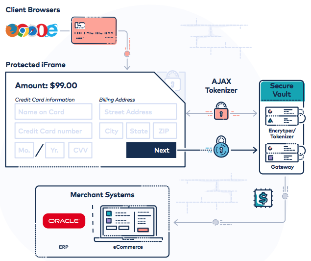

# Overview

The Hosted iFrame Tokenizer helps to reduce your Payment Card Industry (PCI) Data Security Standards (DSS) audit scope by providing a secure iframe that can be embedded in your online checkout page to accept and transmit sensitive payment data to CardSecure for tokenization.

# What's New?

<!-- theme: warning -->
> Visit [Statuspage](https://status.cardconnect.com/) and click **subscribe to updates** to receive important release and status notifications.

## Date Updated 8/20/2021

The changes below were deployed to the UAT environment on 6/25/2021 and later deployed to the production environment on 7/24/2021.

### New Optional Parameters

A new `sendcardtypingevent` parameter is available in this release. If **true**, events are sent to the parent page when input to the Card Number field is detected and when the input has completed or timed out.

Additionally, a new `selectinputdelay` parameter is available and intended for mobile implementations where user input unexpectedly causes already populated fields to be cleared.

| Parameter | Default Value | Description | 
| --- | --- | --- |
| sendcardtypingevent | false | If true, an event is sent to the parent page with 'cardTyping':true when the user begins entering a value into the Card Number field. When an onBlur event occurs or the inactivityto value has been met, the card number value is submitted for tokenization and an event is sent to the parent page with 'cardTyping':false. <br> <br> An example of this event can viewed in the web browser's console on the following example page: <br> https://fts-uat.cardconnect.com/itoke/outer-page.html?sendcardtypingevent=true |
| selectinputdelay | 0 | **Note**: This parameter is intended for iOS implementations where user input unexpectedly causes already populated fields to be cleared. <br> <br> Controls how long (in milliseconds) to ignore input to a newly selected field after changing focus. The default value of 0 represents no delay in accepting input to a newly selected field, whereas the maximum value of 1000 represents a 1 second delay before accepting input to a newly selected field. A value of 100 is typically sufficient to avoid unintended clearing without interfering with the user experience. |

### Accessibility Enhancement

The iFrame Tokenizer now includes the `for` HTML attribute for all `label` HTML elements, containing a value that matches the name of the respective input field. This enhancement allows clicking on the label to focus the cursor on the label's respective input field.

Additionally, all `input` and `select` HTML elements now contain the `aria-label` attribute, containing a value that matches the value of the element's `title` for enhanced accessibility.

<!-- theme: warning -->
> When no optional parameters are included to specify a custom title for input or select elements, the element's default title is used for the `aria-label` attribute. See the Input Labels section for information on the default values used.

You can view an example of the new for and aria-label attributes for the Card Number label and input field in a snippet of the iFrame source code below:

```
<label for="ccnumfield" id="cccardlabel">Card Number</label>
<input id="ccnumfield" type="tel" name="ccnumfield" size="19" maxlength="2000" autocomplete="off" title="Credit Card Number" aria-label="Credit Card Number">
```

### Support for RSA Encryption

The Hosted iFrame Tokenizer now supports RSA encryption to encrypt account data before sending the tokenize request to CardSecure.

If you already have had a CardSecure RSA key pair generated for you, the iFrame Tokenizer now automatically obtains the public key and encrypts the data during the tokenization request to CardSecure. You can use the browser's developer tools to verify that the data is encrypted using your RSA key when `"encryptionhandler" : "RSA"` is included in the tokenize request.

If you do not have a CardSecure RSA key pair already generated, the iFrame Tokenizer is unable to obtain a public key for encryption and you will now encounter a 'No public key found' error when viewing the request within the browser's developer tools. You may disregard this error, as the iFrame Tokenizer continues to transmit the account data over a secure connection to CardSecure.

If you would like to utilize RSA encryption with the Hosted iFrame Tokenizer, contact CardPointe Support.

## Date Updated 10/31/2020

The changes below were deployed to the UAT environment on 10/15/2020 and to the production environment on 10/31/2020. 

This release includes the changes described in the 3/6/2020 Update, which were previously deployed to the UAT environment only. The changes that are new to this release are outlined in the section below.

### New Optional Parameters for Field Validation

The following optional URL parameters have been added to validate and return error messages for input to the Card Number, CVV, and Expiration Date fields:

| Parameter | Default Value | Description | 
| --- | --- | --- |
| invalidcreditcardevent | false | If **true**, a `'message'` event is sent to the parent page when the iFrame determines that the value for the Card Number field is invalid or empty. <br> <br> The `'data'` property in the event will contain an empty string, and the `'validationError'` property will contain a description of the validation failure. <br> <br> **Note**: _This parameter should be used in place of_ `invalidinputevent` _when enabling the_ `usecvv` _or_ `useexpiry` _parameters_. |
| invalidcvvevent | false | If **true**, a `'message'` event is sent to the parent page when the iFrame determines that the value for the CVV field is invalid or empty. <br> <br> The `'data'` property in the event will contain an empty string, and the `'validationError'` property will contain a description of the validation failure. <br> <br> **Note**: _Requires_ `usecvv=true`. |
| invalidexpiryevent | false | If **true**, a `'message'` event is sent to the parent page when the iFrame determines that the value for the Expiration Date field is invalid or empty. <br> <br> The `'data'` property in the event will contain an empty string, and the `'validationError'` property will contain a description of the validation failure. <br> <br> **Note**: _Requires_ `useexpiry=true`. |

<!-- type: row -->

<!-- type: card
title: Hosted iFrame Tokenizer Changelog
description: Visit the Changelog for more information on recent updates to the Hosted iFrame Tokenizer
-->

<!-- type: row-end -->

# Understanding the Hosted iFrame Tokenizer

The Hosted iFrame Tokenizer is a secure, hosted web form that contains the input fields necessary for your site visitors to enter their sensitive payment data. This page is incorporated into your own web page using an HTML iframe element.

Your site visitors enter sensitive payment data into the fields of the embedded iframe and this data is then passed securely to CardSecure for tokenization. The tokenized value generated by CardSecure is returned to your web page through the iframe, and is not considered sensitive in nature. You may store this token and use it in a subsequent call to the CardPointe Gateway to process the payment.

The following diagram illustrates the Hosted iFrame Tokenizer data flow at a high level:

<!-- align: center -->


<!-- theme: warning -->
> For more information on CardSecure tokens, see the CardSecure Developer Guide.

## Implementation Examples

The following examples illustrate various sample implementations of the Hosted iFrame Tokenizer. Click the links in the table below to preview each example. The default implementation, with no optional parameters, includes only the Card Number field used to tokenize the payment account. 

The Hosted iFrame Tokenizer supports optional parameters to gather additional details for processing payments using the CardPointe Gateway API (for example, expiration and CVV) as well as to customize the look and feel of the iFrame. See Optional Parameters, later in this guide, for detailed information on customizing the Hosted iFrame Tokenizer.

<!-- theme: warning -->
> To experiment with additional customizations, you can modify the sample page URL to add and remove parameters. 
>
> For example, to include Expiration Date and CVV fields on the Default Implementation example, append `?useexpiry=true&usecvv=true` to the URL.

| Tokenizer Implementation | Description |
| --- | --- |
| Default Implementation | The default implementation with no optional parameters included.
| Luhn Validation Enabled with Custom Styling | Luhn/Mod 10 validation is enabled by using `invalidinputevent=true` and custom CSS is defined using optional parameter `css`. The custom CSS is URL encoded and stylizes the Card Number field red when invalid. <br> <br> View the Luhn/Mod 10 Validation section for further information on stylizing the Card Number field when the value entered is invalid. |
| CVV & Expiry Fields Enabled | The following optional parameters are used: <br> <br> `useexpiry=true` <br> `usecvv=true` |
| CVV & Expiry Fields Enabled with Custom Input Field Labels | The following optional parameters are used: <br> <br> `useexpiry=true` <br> `usecvv=true` <br> `cardlabel=Custom Card Number Label` <br> `expirylabel=Custom Expiration Date Label` <br> `cvvlabel=Custom CVV Label` |
| Mobile ACH Implementation | The mobile ACH implementation enables the full mobile keyboard. This allows entry of the forward slash character that separates the routing number and bank account number. Additional parameters mask the bank account number after 2000 milliseconds (2 seconds) of inactivity. <br> <br> The following optional parameters are used: <br> <br> `fullmobilekeyboard=true` <br> `tokenizewheninactive=true` <br> `inactivityto=2000` |

# Implementing the Hosted iFrame Tokenizer

Embedding the Hosted iFrame Tokenizer into your web page requires:

- an HTML iframe element
- a hidden HTML input element
- a JavaScript event listener

<!-- theme: warning -->
> Additionally, we strongly recommend using reCAPTCHA to prevent fraud and carding attacks performed by malicious software (also known as "bots"). 
> 
> For more information on preventing carding attacks, see our LaunchPointe article here.

The iframe element loads the Hosted iFrame Tokenizer within your web page and displays the Card Number field for user input. By providing additional optional parameters, the iframe can also display input fields for expiration date and CVV.

The hidden HTML input element is used to store the tokenized payment data returned by the iFrame Tokenizer so that it can be used to authorize and capture a transaction using the CardPointe Gateway API.

The JavaScript event listener is triggered when the iFrame Tokenizer returns the payment token, and the script parses the response and stores the token in the hidden input field for use.

Each step in implementing the iFrame Tokenizer is covered in the basic HTML example below.

> Replace <site> in the URL with the appropriate site for your UAT or Production application. 

## Implementation Steps

1) Where the clear text credit card number is entered, place a reference to the embedded iframe page and style the iframe element on the primary payment page as needed.

#### Create HTML Form with Nested iFrame

```HTML
<form name="tokenform" id="tokenform">
    <iframe id="tokenFrame" name="tokenFrame" src="https://<site>.cardconnect.com/itoke/ajax-tokenizer.html" frameborder="0" scrolling="no"></iframe>
</form>
```

2) On the primary payment page, place a hidden input field to store the token after it is generated within the iframe.

#### Append Hidden Input Field to Hold the Generated Token

```HTML
<form name="tokenform" id="tokenform">
    <iframe id="tokenFrame" name="tokenFrame" src="https://<site>.cardconnect.com/itoke/ajax-tokenizer.html" frameborder="0" scrolling="no"></iframe>
    <input type="hidden" name="mytoken" id="mytoken"/>
</form>
```

3) Attach a listener to detect when token generation is complete and assign the value to the input field above.

#### Include Javascript Event Listener in HTML Head

```JavaScript
<script language="JavaScript">
    window.addEventListener('message', function(event) {
        var token = JSON.parse(event.data);
        var mytoken = document.getElementById('mytoken');
        mytoken.value = token.message;
    }, false);
</script>
```

The following HTML snippet shows key elements of the primary payment page.

#### Complete HTML Example

```HTML
<html>
<head>
<script language="JavaScript">
    window.addEventListener('message', function(event) {
        var token = JSON.parse(event.data);
        var mytoken = document.getElementById('mytoken');
        mytoken.value = token.message;
    }, false);
</script>
</head>
<body>
    <form name="tokenform" id="tokenform">
        <iframe id="tokenFrame" name="tokenFrame" src="https://<site>.cardconnect.com/itoke/ajax-tokenizer.html" frameborder="0" scrolling="no"></iframe>
        <input type="hidden" name="mytoken" id="mytoken"/>
</form>
</body>
</html>
```

## Optional Parameters

You can customize aspects of the Hosted iFrame Tokenizer by including optional parameters that override the default configuration. Read through each of the sections below for an overview of the customization available.

Additionally, you can customize the style of the iFrame Tokenizer using the optional `css` parameter, which is not referenced in the sections below. View the iFrame Styling section for more information about customizing the appearance of the iFrame Tokenizer.

### iFrame Controls

The following parameters are used to override the default behavior, display, and response of the Hosted iFrame Tokenizer.

<!-- theme: warning -->
> If your web page might be accessed from a mobile device, you should add the `tokenizewheninactive` and `inactivityto` parameters.
>
> Additionally, if you accept ACH payments, include the `fullmobilekeyboard` parameter.

| Parameter Name | Default Value | Description |
| --- | --- | --- |
| autofocus |	false |	If **true**, the input field will be focused when the page loads. |
| cardinputmaxlength | 2000	| Controls the maximum character limit for the card number field. |
| cardnumbernumericonly	| false	| If **true**, the card number input field ignores non-numeric values. |
| enhancedresponse	| false	| If **true**, the following additional parameters will be included in the JSON response after a tokenization attempt: <br> <br> **token** - the token if tokenization was successful, otherwise an empty string <br> **errorCode** - one of the following: <br> - The error code from CardSecure on tokenization failure <br> - A custom iFrame Tokenizer error code <br> - '0' if no error occurred <br> **errorMessage** - the error message from CardSecure on tokenization failure; otherwise, an empty string. <br> <br> See Error Codes and Messages in the CardSecure API for detailed information. |
| fullmobilekeyboard | false | Displays a full alphanumeric keyboard in mobile web browsers (iOS and Android). This allows users to enter a forward slash (/) when entering an ACH routing/account number string. <br> <br> If **fullmobilekeyboard** is true, it changes the `type` attribute of the HTML input field to `'text'` which enables a full alphanumeric keyboard to be displayed in web browsers on iOS and Android. If **false** or not provided, the input field type is set to `'tel'`. <br> <br> Set to **true** if you want to allow your users to enter ACH input. |
| inactivityto	| 500	| Controls how long (in milliseconds) the page will wait after an `onInput` event before considering input complete. Applies to both `'tokenizewheninactive'` mode and to swipes with a USB device. |
| invalidcreditcardevent | false | **Note**: _This parameter should be used in place of_ `invalidinputevent` _when enabling the_ `usecvv` _or_ `useexpiry` _parameters_. <br> <br> If **true**, a `'message'` event is sent to the parent page when the iFrame determines that the value for the Card Number field is invalid or empty. <br> <br> The `'data'` property in the event will contain an empty string, and the `'validationError'` property will contain a description of the validation failure. <br> <br> An example of this event can viewed in the web browser's console on the following example page: <br> https://fts-uat.cardconnect.com/itoke/outer-page.html?useexpiry=true&invalidcreditcardevent=true. |
| invalidcvvevent	| false |	If **true**, a `'message'` event is sent to the parent page when the iFrame determines that the value for the CVV field is invalid or empty. <br> <br> The `'data'` property in the event will contain an empty string, and the `'validationError'` property will contain a description of the validation failure. <br> <br> **Note**: _Requires_ `usecvv=true`. <br> <br> An example of this event can viewed in the web browser's console on the following example page: <br> https://fts-uat.cardconnect.com/itoke/outer-page.html?usecvv=true&invalidcvvevent=true |
| invalidexpiryevent | false | If **true**, a `'message'` event is sent to the parent page when the iFrame determines that the value for the Expiration Date field is invalid or empty. <br> <br> The `'data'` property in the event will contain an empty string, and the `'validationError'` property will contain a description of the validation failure. <br> <br> **Note**: _Requires_ `useexpiry=true`. <br> <br> An example of this event can viewed in the web browser's console on the following example page: <br> https://fts-uat.cardconnect.com/itoke/outer-page.html?useexpiry=true&invalidexpiryevent=true |
| invalidinputevent	| false |	**Note**: _This parameter should be used in place of_ `invalidcreditcardevent` _when your implementation only requires the Card Number field_. <br> <br> If **true**, a `'message'` event is sent to the parent page when the iFrame determines that the value for the Card Number field is invalid or empty. <br> <br> The `'data'` property in the event will contain an empty string, and the `'validationError'` property will contain a description of the validation failure. <br> <br> An example of this event can viewed in the web browser's console on the following example page: <br> https://fts-uat.cardconnect.com/itoke/outer-page.html?invalidinputevent=true |
| orientation	| default |	Controls the orientation of the elements within the iFrame. <br> <br> Supported values are: <br> <br> **default** - the default orientation, used if no value is passed for this parameter. <br> **horizontal** <br> **vertical** <br> **custom** |
| selectinputdelay | 0 | **Note**: _This parameter is intended for iOS implementations where user input unexpectedly causes already populated fields to be cleared_. <br> <br> Controls how long (in milliseconds) to ignore input to a newly selected field after changing focus. The default value of 0 represents no delay in accepting input to a newly selected field, whereas the maximum value of 1000 represents a 1 second delay before accepting input to a newly selected field. A value of 100 is typically sufficient to avoid unintended clearing without interfering with the user experience. |
| sendcardtypingevent	| false |	If **true**, an event is sent to the parent page with `'cardTyping':true` when the user begins entering a value into the Card Number field. When an `onBlur` event occurs or the `inactivityto` value has been met, the card number value is submitted for tokenization and an event is sent to the parent page with `'cardTyping':false`. <br> <br> An example of this event can viewed in the web browser's console on the following example page: <br> https://fts-uat.cardconnect.com/itoke/outer-page.html?sendcardtypingevent=true |
| swipeonly	| false	| If **true**, any input that has an input rate less than the `swiperate` threshold will be cleared out. <br> Set this to true if the iFrame is only beingused with USB keyboard devices and manual input is not permitted. |
| swiperate	| 0.2 | Defines the threshold for determining whether input is coming from a swipe on a USB device or a user typing on a keyboard. The default value of 0.2 represents .2 characters per millisecond, or 200 characters per second. The default should only be reduced if swipes are not being recognized correctly by the iFrame. |
| tokenizewheninactive | false | **Note**: _This parameter should be used for mobile implementations_. <br> <br> Validation and tokenization for manual input is normally performed when an `onBlur` event occurs on the input field (for example, when the user clicks/tabs to the next field in the form). If `'tokenizewheninactive'` is set to true, validation and tokenization will be performed once the input field stops receiving input from the user. This inactivity duration is configurable through the `'inactivityto'` parameter. Note that the `onBlur` event will not be used at all if `'tokenizewheninactive'` is set to true and that `'inactivityto'` is also used to determine when a swipe has completed. |
| tokenpropname |	message |	Controls the name of the token property in the JSON message that is sent to the parent page. <br> <br> This must be an alphanumeric value. |
| unique | false | If **true**, CardSecure generates a unique token for each tokenization of a given card number. |

### Input Placeholders

The following parameters are used to supply placeholder text displayed within the various input fields.

| Parameter Name | Default Value | Description | 
| --- | --- | --- |
| placeholder	| none	| A string value to be used as placeholder text for the input field of the tokenizer, specified using the HTML input field's placeholder attribute. This feature is not supported on versions of Internet Explorer older than IE 10. <br> <br> Note the following restrictions when including a placeholder string: <br> <br> The string must be URL-encoded. <br> <br> Only the following characters are supported: <br> letters <br> numbers <br> spaces <br> symbols — !, #, $, %, &, *, +, -, _, =, ?, @, ], [, }, {, ), (, /, |, \, ^, ~, :, single-quote ('), double-quote ("), backtick (`), period (.), semi-colon (;), and comma (,) <br> limited international characters — Á, É, Í, Ñ, Ó, Ú, Ü, á, é, í, ñ, ó, ú, ü, â, ç, è, ê, î, ô, û, ã, õ, à, ä, ö, ß, ā, ē, ī, ō, ū, ё, й, ъ, ы, э, щ <br> <br> The maximum string length is 60 characters. |
